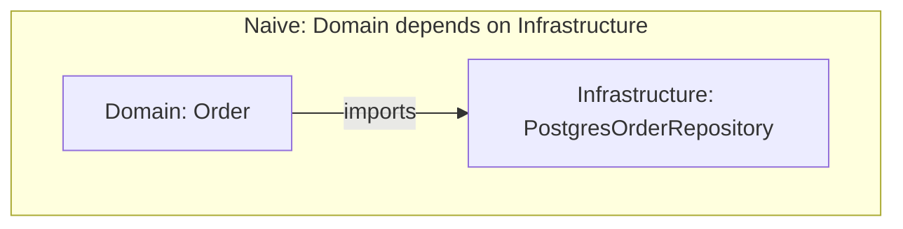
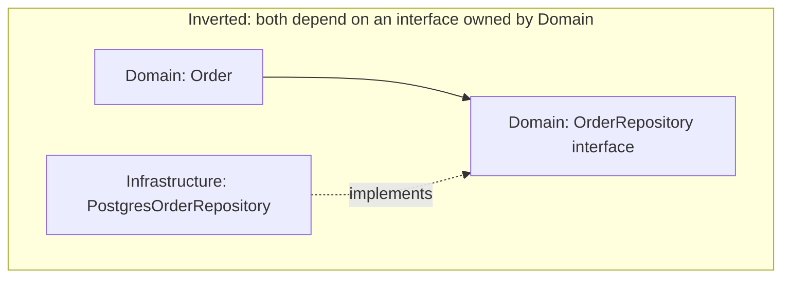

# Layered Architecture: Best Practices

## Overview

Layered architecture is simple to describe but easy to erode in practice. This document covers the dependency rule in depth, how to keep the domain layer framework-free with Dependency Inversion, the anti-patterns that signal erosion, testing implications per layer, and a pre-flight checklist.

## Table of Contents

- [The Dependency Rule in Practice](#the-dependency-rule-in-practice)
- [Dependency Inversion for a Framework-Free Domain](#dependency-inversion-for-a-framework-free-domain)
- [Anti-Patterns](#anti-patterns)
- [Testing Implications Per Layer](#testing-implications-per-layer)
- [Checklist](#checklist)

## The Dependency Rule in Practice

The rule — *dependencies point downward, never upward, never skip a layer* — is easy to state and easy to break under deadline pressure. Enforcing it mechanically, not just by convention, is what keeps it alive:

- **Lint/architecture-test it.** Tools like `dependency-cruiser` (JS/TS), `ArchUnit` (Java), or `import-linter` (Python) can fail the build if `domain/` imports anything from `infrastructure/`.
- **Put layers in separate packages/modules**, not just separate folders, wherever the language supports it — a compiler error is stronger than a code-review comment.
- **Review new "just this once" shortcuts specifically** — a controller calling a repository directly, or a service returning an ORM entity straight to the presentation layer, are the two most common places the rule quietly breaks.

## Dependency Inversion for a Framework-Free Domain

The naive version of layering has the Domain layer depend on Infrastructure directly (`Order` imports `PostgresOrderRepository`). Dependency Inversion flips this:





```typescript
// domain/OrderRepository.ts — interface lives in the domain layer
interface OrderRepository {
  save(order: Order): Promise<void>;
  findById(id: OrderId): Promise<Order | null>;
}

// infrastructure/PostgresOrderRepository.ts — implementation lives outside
class PostgresOrderRepository implements OrderRepository { /* ... */ }

// composition root (application startup) wires the two together
const orderRepository: OrderRepository = new PostgresOrderRepository(db);
const placeOrder = new PlaceOrderService(orderRepository, inventoryPolicy);
```

Now `Order` and `PlaceOrderService` can be compiled, run, and unit-tested with zero knowledge of Postgres — this is the mechanism that lets Layered Architecture evolve toward [Hexagonal Architecture](../07-hexagonal/readme.md), which generalizes the same idea to every external dependency, not just persistence.

## Anti-Patterns

### Anemic Domain Model
Entities become pure data bags (getters/setters only) while all business logic lives in the Application layer's services. The domain layer stops protecting its own invariants, and validation gets duplicated across every service that touches the entity.

```typescript
// ❌ Anemic: Order can be put into an invalid state from anywhere
class Order { items: Item[] = []; status = 'placed'; }

// ✅ Rich: Order enforces its own invariants
class Order {
  static create(items: Item[]): Order {
    if (items.length === 0) throw new EmptyOrderError();
    return new Order(items, OrderStatus.Placed);
  }
}
```

### Layer Skipping
A controller queries the database directly for a "simple read," or a domain entity calls an infrastructure client directly for "just this one integration." Each skip is small; the accumulation is what turns a layered app into an unmaintainable tangle. See [Example Diagram](./example-diagram.md#correct-flow-vs-layering-violation) for the visual.

### Fat Controllers
Business logic (discount calculation, validation beyond input shape, orchestration across multiple domain objects) creeping into the presentation layer because "it's faster to just add it here." This makes the logic untestable without spinning up HTTP infrastructure and unavailable to any other entry point (a CLI, a message consumer) that needs the same use case.

### God Service
The opposite failure in the Application layer: one `OrderService` grows to handle placing orders, cancelling orders, generating reports, and sending emails, because nobody drew a line around what a single use case is.

## Testing Implications Per Layer

| Layer | Test Type | What's Mocked | Speed |
|-------|-----------|----------------|-------|
| **Domain** | Pure unit tests | Nothing — no I/O to mock | Fastest |
| **Application** | Unit tests | Repository/gateway interfaces (in-memory fakes or mocks) | Fast |
| **Infrastructure** | Integration tests | Nothing internal — hits a real or test-container database/API | Slower |
| **Presentation** | Contract / E2E tests | Application layer (for contract tests) or nothing (for full E2E) | Slowest |

A healthy layered application follows the testing pyramid: many fast domain and application tests, fewer infrastructure integration tests, and a thin layer of end-to-end tests through the presentation layer.

## Checklist

- [ ] Domain layer has zero imports from Infrastructure or web frameworks
- [ ] Every cross-layer dependency the Domain/Application layers need is expressed as an interface they own
- [ ] No controller executes a database query or calls a third-party API directly
- [ ] Business rules live in the Domain layer, not scattered across controllers and services
- [ ] Cross-cutting concerns (logging, auth, caching) are applied via middleware/decorators, not called from within the Domain layer
- [ ] An architecture-linting rule (or code review checklist item) exists to catch new layer violations
- [ ] Domain and Application layers have fast unit test coverage; Infrastructure has integration test coverage

Return to [readme.md](./readme.md) for the pattern overview, or [Components](./components.md) for what belongs in each layer.
