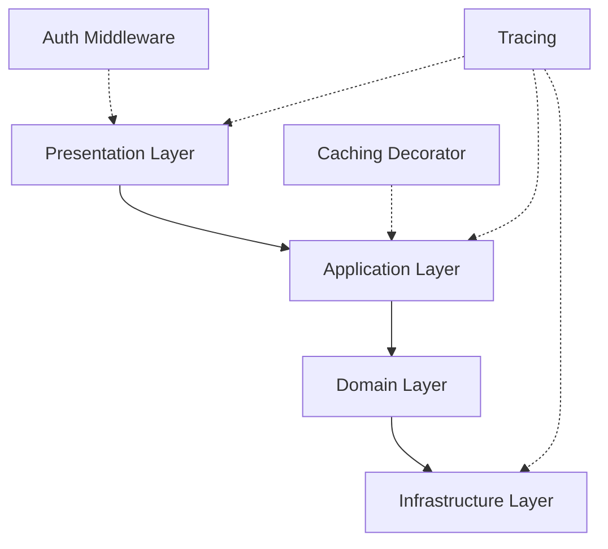
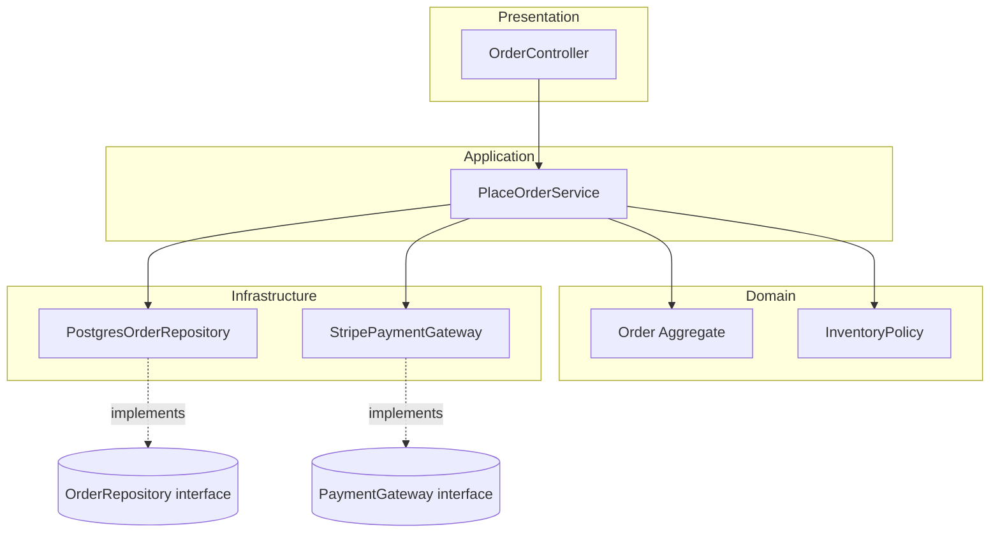

# Layered Architecture: Components

## Overview

This document goes layer by layer through a layered application, describing exactly what belongs in each one, what it must never depend on, and how the four layers cooperate through the bookstore "place order" example introduced in [readme.md](./readme.md).

## Table of Contents

- [Presentation Layer](#presentation-layer)
- [Application Layer](#application-layer)
- [Domain Layer](#domain-layer)
- [Infrastructure Layer](#infrastructure-layer)
- [Cross-Cutting Concerns](#cross-cutting-concerns)
- [Component Interaction Diagram](#component-interaction-diagram)

## Presentation Layer

**Responsibility**: translate the outside world's protocol (HTTP, GraphQL, CLI, gRPC) into calls the application layer understands, and translate results back.

**Must never contain**: business rules, SQL, or direct calls to the domain layer's internals.

```typescript
// presentation/OrderController.ts
class OrderController {
  constructor(private placeOrder: PlaceOrderService) {}

  async handlePlaceOrder(req: Request, res: Response) {
    const command = new PlaceOrderCommand(req.body.items, req.body.address);
    const result = await this.placeOrder.execute(command);
    res.status(201).json({ orderId: result.orderId });
  }
}
```

Typical building blocks: controllers, GraphQL resolvers, view models, request/response DTOs, input validation (shape, not business validity), authentication middleware.

## Application Layer

**Responsibility**: orchestrate a single use case — fetch what's needed, call the domain, persist the result, and coordinate infrastructure — without containing business rules itself.

**Must never contain**: HTTP concerns (status codes, headers) or SQL.

```typescript
// application/PlaceOrderService.ts
class PlaceOrderService {
  constructor(
    private orders: OrderRepository,
    private inventory: InventoryPolicy
  ) {}

  async execute(command: PlaceOrderCommand): Promise<PlaceOrderResult> {
    const order = Order.create(command.items, command.address, this.inventory);
    await this.orders.save(order);
    return new PlaceOrderResult(order.id);
  }
}
```

Typical building blocks: application services, command/query handlers, DTOs used for input/output of a use case, transaction boundaries.

## Domain Layer

**Responsibility**: the actual business rules — the part of the system that would still make sense if you swapped the database, the web framework, and the cloud provider all at once.

**Must never contain**: framework annotations, ORM base classes it can't live without, HTTP or SQL of any kind.

```typescript
// domain/Order.ts
class Order {
  private constructor(
    public readonly id: OrderId,
    private lines: OrderLine[],
    private status: OrderStatus
  ) {}

  static create(items: Item[], address: Address, inventory: InventoryPolicy): Order {
    if (items.length === 0) throw new EmptyOrderError();
    for (const item of items) {
      inventory.assertAvailable(item.sku, item.quantity);
    }
    return new Order(OrderId.generate(), items.map(OrderLine.from), OrderStatus.Placed);
  }

  total(): Money {
    return this.lines.reduce((sum, l) => sum.add(l.subtotal()), Money.zero());
  }
}
```

Typical building blocks: entities, value objects (`Money`, `Address`), domain services, domain events, invariant validation.

## Infrastructure Layer

**Responsibility**: implement the technical details the domain and application layers depend on through interfaces — databases, message brokers, third-party APIs, the filesystem.

```typescript
// infrastructure/PostgresOrderRepository.ts
class PostgresOrderRepository implements OrderRepository {
  constructor(private db: DbClient) {}

  async save(order: Order): Promise<void> {
    await this.db.query(
      'INSERT INTO orders (id, status, total_cents) VALUES ($1, $2, $3)',
      [order.id.value, order.status, order.total().cents]
    );
  }
}
```

Typical building blocks: repository implementations, ORM entities/mappings, HTTP clients for third-party APIs, message publishers/consumers, file storage adapters.

Notice `OrderRepository` is *defined* in the domain or application layer as an interface, and *implemented* here — this small inversion is what keeps the dependency arrow pointing from Infrastructure back toward Domain rather than the other way around.

## Cross-Cutting Concerns

Logging, authentication/authorization, caching, and metrics don't belong to any single layer, but they still must not violate the dependency rule. Two common approaches:

1. **Middleware/interceptors** at the presentation boundary (auth checks, request logging, rate limiting).
2. **Decorators around application services** (caching a query handler's result, wrapping a command handler in a transaction, timing/tracing a use case).



Cross-cutting code should never be *called from* the domain layer — if the domain needs to log something meaningful, it raises a domain event and lets an outer layer decide how to log/publish it.

## Component Interaction Diagram



See [Example Diagram](./example-diagram.md) for the full request-flow sequence and a side-by-side view of a layering violation.
