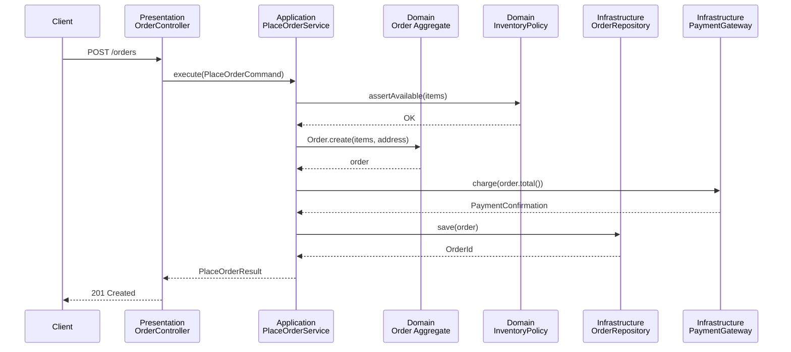
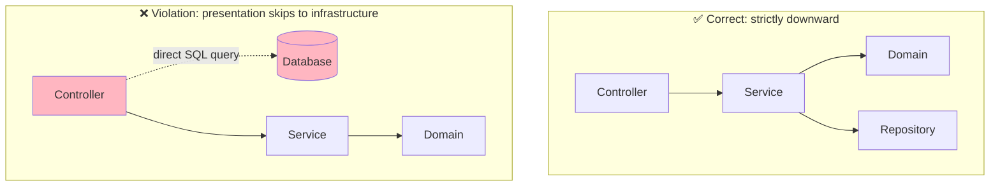
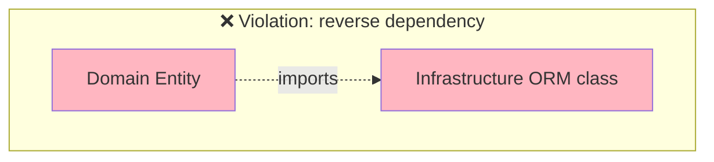
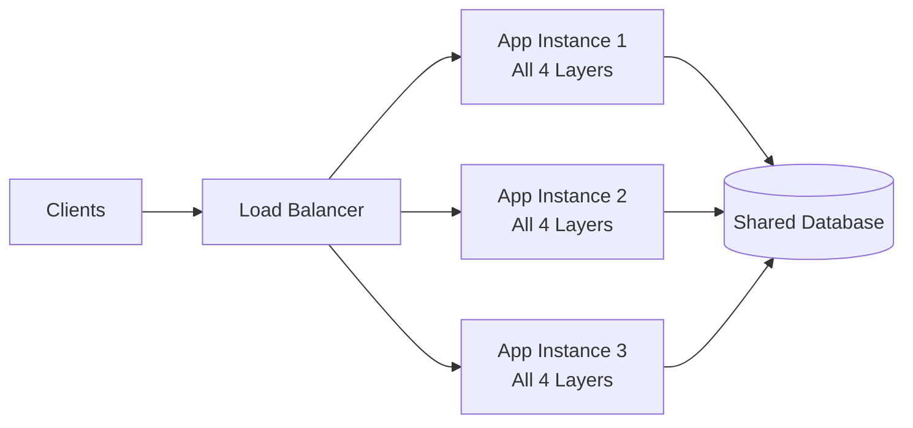

# Layered Architecture: Example Diagrams

## Overview

This document collects visual references for the layered architecture pattern: the full request-flow sequence, a side-by-side comparison of a correct flow versus a layering violation, and the physical folder structure of a layered project. See [readme.md](./readme.md) for the narrative overview and [Components](./components.md) for what belongs in each layer.

## Full Request-Flow Sequence



## Correct Flow vs. Layering Violation



The violation on the right is the single most common way layered codebases rot: a controller calls the database "just this once" for a report or a quick read, bypassing the application and domain layers entirely. Six months later there are dozens of these shortcuts and no layer boundary means anything anymore.



This second violation is subtler: a domain entity extends or imports an ORM base class, framework annotation, or HTTP-specific type. Now the "pure" domain layer cannot be tested or reused without dragging in infrastructure — see [Best Practices](./best-practises.md#the-dependency-rule-in-practice) for how Dependency Inversion prevents this.

## Physical Project Structure

```
bookstore-app/
├── src/
│   ├── presentation/
│   │   ├── controllers/
│   │   │   └── OrderController.ts
│   │   └── dto/
│   │       └── PlaceOrderRequest.ts
│   ├── application/
│   │   ├── services/
│   │   │   └── PlaceOrderService.ts
│   │   └── commands/
│   │       └── PlaceOrderCommand.ts
│   ├── domain/
│   │   ├── entities/
│   │   │   └── Order.ts
│   │   ├── value-objects/
│   │   │   └── Money.ts
│   │   └── repositories/
│   │       └── OrderRepository.ts        # interface only
│   └── infrastructure/
│       ├── persistence/
│       │   └── PostgresOrderRepository.ts # implements domain interface
│       └── payments/
│           └── StripePaymentGateway.ts
└── tests/
    ├── domain/          # pure unit tests, no mocks needed
    ├── application/     # unit tests with mocked repositories
    └── infrastructure/  # integration tests against real/test DB
```

Notice the folder structure mirrors the dependency rule: `domain/` has no imports from `infrastructure/`, while `infrastructure/` imports and implements interfaces declared in `domain/`.

## Data Flow Under Load



Because a layered application is typically deployed as a single unit (see [Monolithic Architecture](../01-monolithic/readme.md)), scaling means running more identical copies of *all four layers* behind a load balancer — there is no way to scale, say, just the Domain layer independently. That trade-off is one of the main reasons teams eventually migrate toward [Microservices](../03-microservices/readme.md) as a codebase and team grow.
