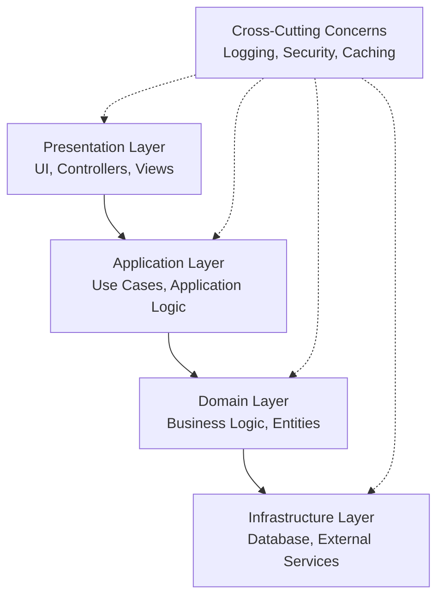
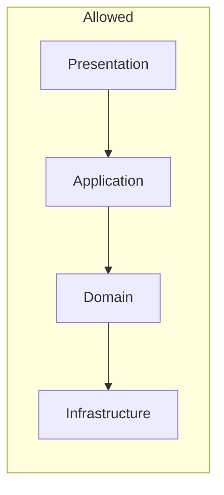
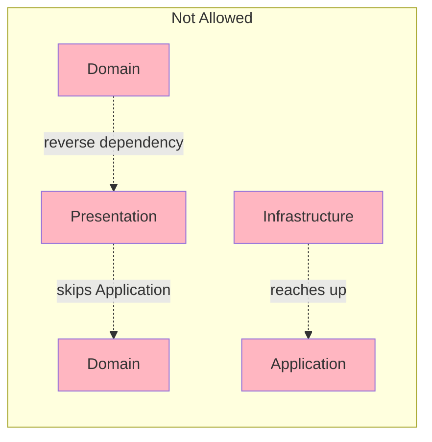
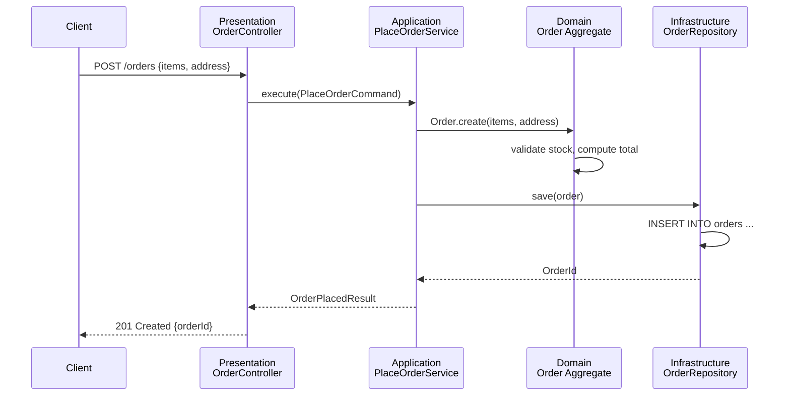
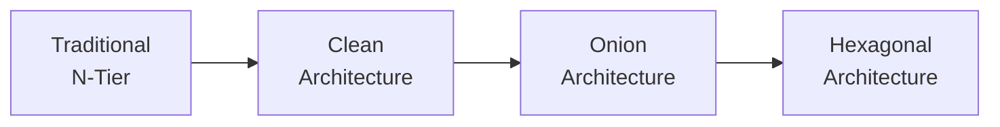

# Layered Architecture

## Overview

Layered architecture (also called N-Tier architecture) organizes an application into horizontal layers, each with a specific responsibility. Dependencies flow in one direction — typically downward, from the layer closest to the user toward the layer closest to the data — so that each layer only knows about the layer directly beneath it.

## Table of Contents

- [What is Layered Architecture?](#what-is-layered-architecture)
- [The Four Canonical Layers](#the-four-canonical-layers)
- [The Dependency Rule](#the-dependency-rule)
- [Request Flow Walkthrough](#request-flow-walkthrough)
- [When to Use](#when-to-use)
- [Variations](#variations)
- [Related Documents](#related-documents)
- [Further Reading](#further-reading)

## What is Layered Architecture?

A layered application is sliced horizontally by *technical concern* rather than by *business capability*. Every request enters at the top layer and is handed down, layer by layer, until it reaches persistence, then the response travels back up the same path.

> **Layered Architecture**: An architectural style where responsibilities are grouped into horizontal layers, with each layer depending only on the layer(s) beneath it, never the reverse.

This is the default mental model most developers learn first — a typical MVC web framework, a Spring Boot application with Controller → Service → Repository, or a Django app with Views → Services → Models are all layered architectures in practice, whether or not the team names it that way.

## The Four Canonical Layers



| Layer | Responsibility | Depends On | Examples |
|-------|-----------------|------------|----------|
| **Presentation** | Accepts input, renders output | Application layer | REST controllers, GraphQL resolvers, CLI handlers |
| **Application** | Orchestrates use cases, no business rules of its own | Domain layer | Application services, command/query handlers |
| **Domain** | Core business logic and rules | Nothing (ideally) | Entities, value objects, domain services |
| **Infrastructure** | Talks to the outside world | Domain interfaces | Repositories, ORMs, HTTP clients, message publishers |

Running example used throughout this folder's docs: an **online bookstore** with a "place order" feature.

```
Presentation:   OrderController.placeOrder(request)
Application:    PlaceOrderService.execute(command)
Domain:         Order, OrderLine, Money, InventoryPolicy
Infrastructure: PostgresOrderRepository, StripePaymentGateway
```

## The Dependency Rule

The single rule that makes an application "layered" rather than "a pile of files" is: **a layer may only call downward, never upward, and never skip a layer.**





Violating this rule is how a layered codebase quietly turns into a distributed monolith of tangled dependencies — see [Best Practices](./best-practises.md) for the specific anti-patterns to watch for.

## Request Flow Walkthrough



Each arrow crosses exactly one layer boundary — that's the property being protected. See [Example Diagram](./example-diagram.md) for more request-flow variants, including what a *violation* of this flow looks like.

## When to Use

**Good fit:**
- Small to medium teams and codebases
- CRUD-heavy business applications
- Teams new to formal architecture who need a simple, well-understood mental model
- Applications where the domain is not complex enough to justify Hexagonal or Clean Architecture's extra indirection

**Reconsider when:**
- The domain layer's business rules are complex enough that framework/infrastructure leakage into `Domain` becomes a real risk — Hexagonal Architecture makes this explicit
- Independent scaling or deployment of parts of the system is required — consider [Microservices](../03-microservices/readme.md)
- The team is building an audit-trail-heavy system — consider [Event Sourcing](../05-event-sourcing/readme.md)

## Variations



| Variation | Key Difference from Classic N-Tier |
|-----------|--------------------------------------|
| **Traditional N-Tier** | Layers reference concrete implementations of the layer below directly |
| **Clean Architecture** | Adds explicit dependency inversion — inner layers define interfaces, outer layers implement them |
| **Onion Architecture** | Domain sits at the center of concentric rings; all dependencies point inward |
| **Hexagonal Architecture** | Generalizes "layers" into "ports and adapters" so any number of driving/driven adapters can plug into the same core — see [Hexagonal Architecture](../07-hexagonal/readme.md) |

In practice, each variation is the same dependency rule taken one step further toward fully decoupling the domain from frameworks and infrastructure.

## Related Documents

- **[Components](./components.md)**: Detailed responsibilities, boundaries, and code-level examples per layer
- **[Example Diagram](./example-diagram.md)**: Visual request flows, a layering violation compared side-by-side with the correct flow, and a physical folder structure
- **[Best Practices](./best-practises.md)**: The dependency rule in practice, dependency inversion, anti-patterns, and testing implications

## Further Reading

- [Monolithic Architecture](../01-monolithic/readme.md) - Layered architecture is commonly used *inside* a monolith
- [Microservices Architecture](../03-microservices/readme.md) - Each service can itself be internally layered
- [Hexagonal Architecture](../07-hexagonal/readme.md) - A more strict, symmetric evolution of layering

## Documentation Structure

```
02-layered-architecture/
├── readme.md               # This file - comprehensive overview
├── components.md           # Layer-by-layer responsibilities and boundaries
├── example-diagram.md      # Visual request flows and structure diagrams
└── best-practises.md       # Dependency rule, anti-patterns, testing guidance
```

---

**Next Steps:**
1. Read [Components](./components.md) to understand what belongs in each layer
2. Study [Example Diagram](./example-diagram.md) for concrete request flows
3. Apply [Best Practices](./best-practises.md) to avoid the common anti-patterns
