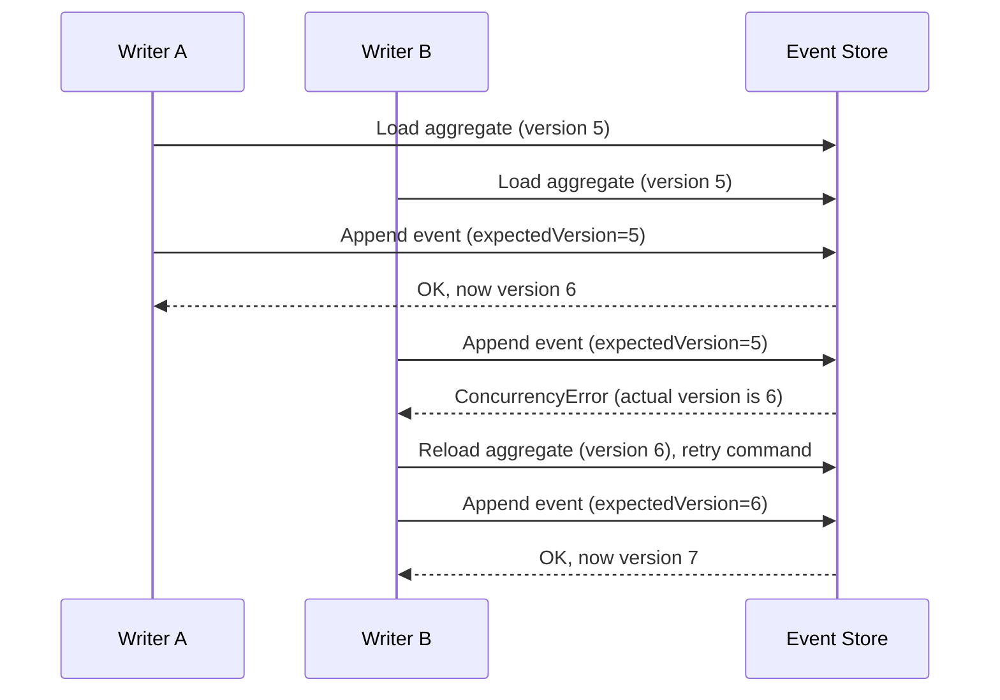
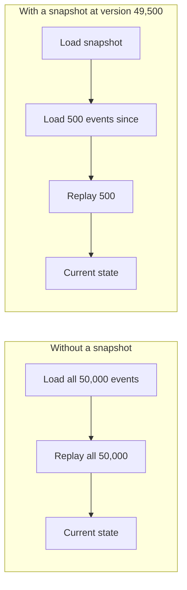

# Event Sourcing: Event Store Design

## Overview

The event store is the single most important piece of infrastructure in an event-sourced system — everything else (aggregates, projections, replay) depends on it durably persisting events in the exact order they were appended, and never allowing them to be edited or silently lost. This document covers the shape of an event record, how the store enforces consistency, and how to choose a storage backend.

See [readme.md](./readme.md) for the pattern overview, and [replaying-events.md](./replaying-events.md) for how stored events get read back and applied.

---

## Event Record Schema

Every event, regardless of its business meaning, carries the same envelope of metadata plus a payload specific to its type:

| Field | Type | Purpose |
|---|---|---|
| `eventId` | UUID | Unique identifier for this specific event |
| `aggregateId` | string | Which entity/stream this event belongs to (e.g. an order ID) |
| `aggregateType` | string | The kind of aggregate (`Order`, `Account`, `Cart`) — lets one store hold many entity types |
| `eventType` | string | The event's class/name (`OrderPlaced`, `MoneyWithdrawn`) |
| `version` | integer | This event's position in its aggregate's stream, starting at 0 or 1 |
| `payload` | JSON | The event-specific data |
| `timestamp` | datetime | When the event was recorded |
| `metadata` | JSON | Cross-cutting context: `userId`, `correlationId`, `causationId`, client IP, etc. |

```typescript
interface StoredEvent {
  eventId: string;
  aggregateId: string;
  aggregateType: string;
  eventType: string;
  version: number;
  payload: Record<string, unknown>;
  timestamp: Date;
  metadata: {
    userId?: string;
    correlationId?: string;
    causationId?: string;
  };
}
```

`correlationId` ties together every event produced while handling one incoming request or workflow; `causationId` records the specific event or command that directly caused this one — both are invaluable when reconstructing "why did this happen" across service boundaries.

---

## Optimistic Concurrency Control

Two commands for the same aggregate can arrive concurrently (two browser tabs, a retried request, a race between a user action and a background job). The event store prevents them from silently overwriting each other's assumptions using the `version` field as an optimistic lock:

```typescript
async function appendEvents(
  aggregateId: string,
  newEvents: DomainEvent[],
  expectedVersion: number
): Promise<void> {
  const currentVersion = await getCurrentVersion(aggregateId);

  if (currentVersion !== expectedVersion) {
    // Someone else appended events to this aggregate since we loaded it
    throw new ConcurrencyError(
      `Expected version ${expectedVersion}, found ${currentVersion}`
    );
  }

  await insertEvents(aggregateId, newEvents, expectedVersion);
}
```

The caller loads an aggregate, remembers the version it was at, applies a command, and then tries to append the resulting events with that remembered version as `expectedVersion`. If another writer got there first, the append is rejected and the caller can reload the aggregate and retry — the same pattern as a compare-and-swap.



---

## Append-Only Guarantees

An event store must physically prevent `UPDATE` and `DELETE` against event rows — the append-only property is what makes the audit trail trustworthy. In practice this means:

- Enforce it at the schema level where possible (e.g. a Postgres table with no `UPDATE`/`DELETE` grants for the application role, only `INSERT`/`SELECT`).
- Never "fix" a bad event in place. If an event was wrong, append a *compensating* event (`OrderCancelledDueToError`) rather than editing history.
- Treat the unique constraint on `(aggregateId, version)` as the concurrency guard described above — it also happens to make duplicate appends fail loudly instead of silently corrupting a stream.

---

## Snapshotting Strategy

Replaying an aggregate with 50,000 events on every command is wasteful. A snapshot is a cached copy of an aggregate's state at a known version, so a load only needs to replay events *since* the snapshot:



Guidelines for snapshotting:

- **Snapshot on a cadence, not on every write** — e.g. every 100–500 events for that aggregate, tuned to how expensive replay actually is.
- **Snapshots are a cache, not a source of truth.** They must be safely deletable and rebuildable at any time by replaying from event zero; never let a snapshot become the only place a piece of state exists.
- **Store the snapshot's version alongside it**, so loading logic knows exactly which events (if any) still need to be replayed on top of it.

---

## Storage Backend Comparison

| Backend | Strengths | Weaknesses | Best for |
|---|---|---|---|
| **Dedicated event store** (e.g. EventStoreDB) | Purpose-built: native stream model, subscriptions, projections, optimistic concurrency built in | Another piece of infrastructure to operate and learn | Systems where event sourcing is central, not incidental |
| **Append-only table in a relational DB** (e.g. PostgreSQL with a `JSONB` payload column) | Reuses infrastructure you likely already run and back up; transactional guarantees are familiar; `(aggregateId, version)` unique index gives concurrency control for free | Not built for streaming subscriptions — consumers typically poll or use `LISTEN/NOTIFY`/logical replication | Teams already running Postgres who want event sourcing for a subset of aggregates |
| **Kafka as an event log** | Extremely high throughput, built-in partitioning by aggregate/key, natural fit if consumers are already Kafka-based | Not a database — no ad-hoc query by aggregate ID without an index elsewhere; retention is time/size based, not "forever" by default | High-volume systems where the event log doubles as the integration backbone between services |

A common, pragmatic starting point: an append-only Postgres table for the event store (durable, transactional, queryable), with Kafka (or an outbox pattern) used separately to *publish* those events to other services and projections.

---

## Related Documents

- [readme.md](./readme.md) — pattern overview
- [Replaying Events](./replaying-events.md) — how snapshots and events get read back and applied
- [Example](./example.md) — a concrete event store implementation
