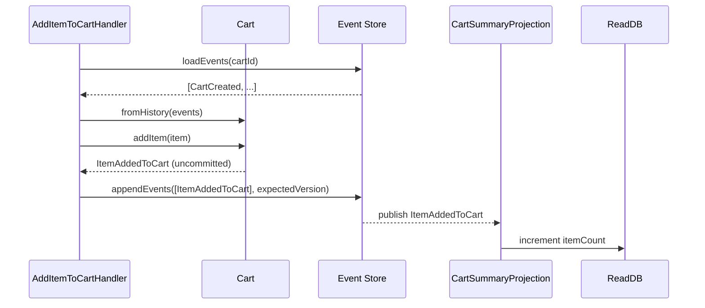

# Event Sourcing: Worked Example

## Overview

This walks through a complete, minimal event-sourced slice for a shopping cart: the events, the aggregate that produces and applies them, appending to an event store, and a projection that turns the stream into a read model. It follows the same shape as [readme.md](./readme.md) and [event-store-design.md](./event-store-design.md) — read those first for the concepts behind each piece shown here.

The domain rules are deliberately small: a cart is created, items are added and removed, and it's eventually checked out. That's enough surface to show every moving part without the example becoming a tutorial in itself.

---

## Domain Events

```typescript
interface DomainEvent {
  eventId: string;
  aggregateId: string;
  aggregateType: 'Cart';
  version: number;
  timestamp: Date;
}

interface CartItem {
  productId: string;
  quantity: number;
  unitPrice: number;
}

class CartCreated implements DomainEvent {
  readonly aggregateType = 'Cart' as const;
  constructor(
    public readonly eventId: string,
    public readonly aggregateId: string,
    public readonly version: number,
    public readonly timestamp: Date,
    public readonly customerId: string
  ) {}
}

class ItemAddedToCart implements DomainEvent {
  readonly aggregateType = 'Cart' as const;
  constructor(
    public readonly eventId: string,
    public readonly aggregateId: string,
    public readonly version: number,
    public readonly timestamp: Date,
    public readonly item: CartItem
  ) {}
}

class ItemRemovedFromCart implements DomainEvent {
  readonly aggregateType = 'Cart' as const;
  constructor(
    public readonly eventId: string,
    public readonly aggregateId: string,
    public readonly version: number,
    public readonly timestamp: Date,
    public readonly productId: string
  ) {}
}

class CartCheckedOut implements DomainEvent {
  readonly aggregateType = 'Cart' as const;
  constructor(
    public readonly eventId: string,
    public readonly aggregateId: string,
    public readonly version: number,
    public readonly timestamp: Date,
    public readonly totalAmount: number
  ) {}
}
```

---

## The Aggregate

The aggregate holds no persistence logic itself — it only knows how to validate commands against its *current* state (derived by applying past events) and how to produce new events.

```typescript
class Cart {
  private id = '';
  private version = 0;
  private customerId = '';
  private items: CartItem[] = [];
  private checkedOut = false;
  private uncommittedEvents: DomainEvent[] = [];

  static create(cartId: string, customerId: string): Cart {
    const cart = new Cart();
    cart.raise(new CartCreated(crypto.randomUUID(), cartId, 1, new Date(), customerId));
    return cart;
  }

  static fromHistory(events: DomainEvent[]): Cart {
    const cart = new Cart();
    for (const event of events) {
      cart.apply(event);
      cart.version = event.version;
    }
    return cart;
  }

  addItem(item: CartItem): void {
    if (this.checkedOut) {
      throw new Error('Cannot modify a checked-out cart');
    }
    this.raise(new ItemAddedToCart(crypto.randomUUID(), this.id, this.version + 1, new Date(), item));
  }

  removeItem(productId: string): void {
    if (this.checkedOut) {
      throw new Error('Cannot modify a checked-out cart');
    }
    if (!this.items.some(i => i.productId === productId)) {
      throw new Error(`Product ${productId} is not in the cart`);
    }
    this.raise(new ItemRemovedFromCart(crypto.randomUUID(), this.id, this.version + 1, new Date(), productId));
  }

  checkout(): void {
    if (this.checkedOut) {
      throw new Error('Cart is already checked out');
    }
    if (this.items.length === 0) {
      throw new Error('Cannot check out an empty cart');
    }
    const total = this.items.reduce((sum, i) => sum + i.quantity * i.unitPrice, 0);
    this.raise(new CartCheckedOut(crypto.randomUUID(), this.id, this.version + 1, new Date(), total));
  }

  // Apply: reconstructs state from a single event. Used both for new
  // events (via raise) and for historical replay (via fromHistory).
  private apply(event: DomainEvent): void {
    if (event instanceof CartCreated) {
      this.id = event.aggregateId;
      this.customerId = event.customerId;
    } else if (event instanceof ItemAddedToCart) {
      this.items.push(event.item);
    } else if (event instanceof ItemRemovedFromCart) {
      this.items = this.items.filter(i => i.productId !== event.productId);
    } else if (event instanceof CartCheckedOut) {
      this.checkedOut = true;
    }
  }

  private raise(event: DomainEvent): void {
    this.apply(event);
    this.version = event.version;
    this.uncommittedEvents.push(event);
  }

  getId(): string { return this.id; }
  getVersion(): number { return this.version; }
  getUncommittedEvents(): readonly DomainEvent[] { return this.uncommittedEvents; }
  markEventsAsCommitted(): void { this.uncommittedEvents = []; }
}
```

---

## Appending to the Event Store

A command handler loads the aggregate (replaying its history), applies a command, and persists the resulting events with an optimistic-concurrency check — see [Event Store Design](./event-store-design.md#optimistic-concurrency-control) for what `expectedVersion` protects against.

```typescript
class AddItemToCartHandler {
  constructor(private readonly eventStore: EventStore) {}

  async handle(command: { cartId: string; item: CartItem }): Promise<void> {
    const history = await this.eventStore.loadEvents(command.cartId);
    const cart = Cart.fromHistory(history);

    const expectedVersion = cart.getVersion();
    cart.addItem(command.item);

    await this.eventStore.appendEvents(
      cart.getId(),
      cart.getUncommittedEvents(),
      expectedVersion
    );
    cart.markEventsAsCommitted();
  }
}
```

---

## Building a Read Model Projection

The read side never loads or replays the aggregate — it maintains its own denormalized view, updated as events arrive, and serves queries straight from that view.

```typescript
interface CartSummary {
  cartId: string;
  customerId: string;
  itemCount: number;
  status: 'open' | 'checked_out';
}

class CartSummaryProjection {
  constructor(private readonly repository: CartSummaryRepository) {}

  async handle(event: DomainEvent): Promise<void> {
    if (event instanceof CartCreated) {
      await this.repository.save({
        cartId: event.aggregateId,
        customerId: event.customerId,
        itemCount: 0,
        status: 'open',
      });
    } else if (event instanceof ItemAddedToCart) {
      const summary = await this.repository.findById(event.aggregateId);
      if (summary) {
        summary.itemCount += 1;
        await this.repository.save(summary);
      }
    } else if (event instanceof ItemRemovedFromCart) {
      const summary = await this.repository.findById(event.aggregateId);
      if (summary && summary.itemCount > 0) {
        summary.itemCount -= 1;
        await this.repository.save(summary);
      }
    } else if (event instanceof CartCheckedOut) {
      const summary = await this.repository.findById(event.aggregateId);
      if (summary) {
        summary.status = 'checked_out';
        await this.repository.save(summary);
      }
    }
  }
}
```



Query code (a "get my cart" endpoint, for instance) reads `CartSummary` rows directly and never touches the `Cart` aggregate or the event store at all — exactly the separation described in [readme.md](./readme.md#architecture).

---

## Related Documents

- [readme.md](./readme.md) — pattern overview
- [Event Store Design](./event-store-design.md) — the schema and guarantees `EventStore` in this example relies on
- [Replaying Events](./replaying-events.md) — how `Cart.fromHistory` and projection rebuilds scale beyond this toy example
