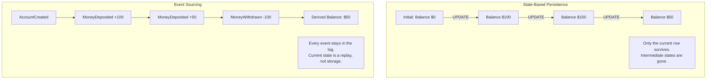
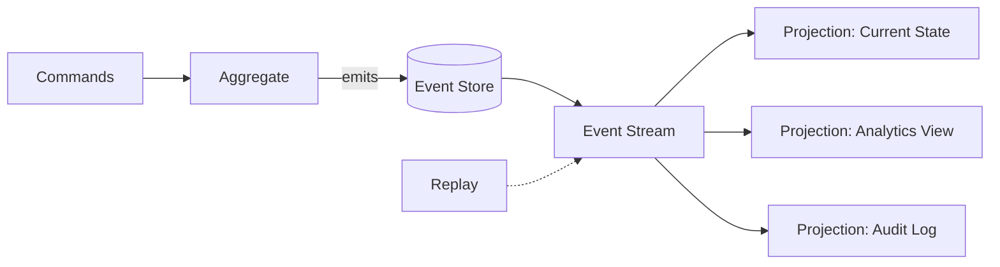
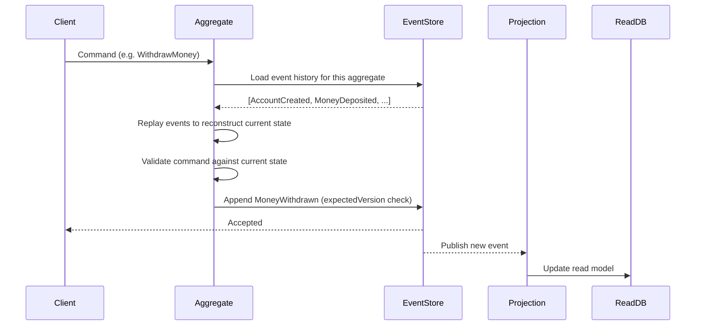

# Event Sourcing

> Store every change to application state as an immutable, ordered sequence of events, and derive current state — and any other view of the data — by replaying that sequence.

## Table of Contents

- [Overview](#overview)
- [Event Sourcing vs. State-Based Persistence](#event-sourcing-vs-state-based-persistence)
- [Core Concepts](#core-concepts)
- [Architecture](#architecture)
- [Why Use Event Sourcing](#why-use-event-sourcing)
- [Trade-offs and When to Avoid It](#trade-offs-and-when-to-avoid-it)
- [Event Sourcing and CQRS](#event-sourcing-and-cqrs)
- [Documentation](#documentation)
- [Related Documents](#related-documents)
- [Further Reading](#further-reading)
- [Documentation Structure](#documentation-structure)

---

## Overview

In a conventional application, a database row holds the *current* state of an entity — an `accounts` table has one row per account, and an `UPDATE` statement overwrites the balance in place. The history of how that balance got there is gone the moment the next update lands, unless something else was built specifically to capture it.

Event sourcing inverts this. Instead of persisting current state, you persist the sequence of **events** that produced it — `AccountCreated`, `MoneyDeposited`, `MoneyWithdrawn` — and the current state becomes a *derived value*, computed by replaying those events in order. The event log is the system of record; every read model, report, and cache is just a projection of it.

---

## Event Sourcing vs. State-Based Persistence



| Aspect | State-Based Persistence | Event Sourcing |
|---|---|---|
| **What's stored** | Current state only | The full history of state changes |
| **Update mechanism** | In-place `UPDATE` | Append-only `INSERT` |
| **History** | Lost unless separately logged | Automatic, complete, and immutable |
| **"Why did this change?"** | Not answerable from the data alone | Answerable — the event *is* the reason |
| **Point-in-time queries** | Requires a separate audit table | Native — replay up to any event |
| **Debugging production issues** | Reproduce from current state and guesswork | Replay the exact event sequence |
| **Read performance** | Fast — data is already shaped for reads | Needs projections and/or snapshots |
| **Storage growth** | Bounded by entity count | Grows with every state change, forever |

---

## Core Concepts

| Concept | Description | Responsibility |
|---|---|---|
| **Event** | An immutable fact that already happened, named in the past tense (`OrderPlaced`, not `PlaceOrder`) | Records what happened, never mutated after creation |
| **Event Store** | An append-only log, partitioned by aggregate/stream ID | Persists events durably and serves them back in order |
| **Aggregate** | A domain entity that accepts commands, enforces invariants, and emits events | Turns intent (a command) into fact (one or more events) |
| **Projection** | A read model built by folding a stream of events into a shape a query needs | Provides fast, purpose-built views over the event log |
| **Replay** | Re-running events, in order, through either an aggregate or a projection | Rebuilds current state or produces a brand-new view retroactively |
| **Snapshot** | A cached materialization of an aggregate's state at a specific version | Avoids replaying the entire history on every load |



---

## Architecture



The write path never queries a "current state" table directly — it always reconstructs state by replaying an aggregate's events (optionally starting from a [snapshot](./event-store-design.md#snapshotting-strategy) instead of event zero). The read path never touches the event store at all; it queries a [projection](./replaying-events.md) that was built ahead of time by consuming the event stream.

---

## Why Use Event Sourcing

- **Complete audit trail, for free.** Every state change is already recorded with who/what/when — no bolt-on audit table to keep in sync.
- **Temporal queries.** "What was this order's status at 3pm yesterday?" is answered by replaying events up to that timestamp, not by guessing from the current row.
- **Debugging by replay.** A production bug can be reproduced exactly by replaying the real event sequence that triggered it, in a test environment.
- **Multiple read models from one source of truth.** A dashboard projection, a search-index projection, and an analytics projection can all be derived from the same event stream without ever touching each other.
- **Retroactive projections.** Need a new report that groups orders by region? Build the projection and replay history through it — you don't need to have planned for it in advance.

## Trade-offs and When to Avoid It

- **Eventual consistency.** Projections update asynchronously after an event is appended; a read immediately after a write may not reflect it yet.
- **Unbounded storage growth.** The log never shrinks on its own — old events matter for replay and audit even after they're "no longer relevant" to current state, so retention/archival has to be a deliberate decision.
- **Schema evolution is a first-class problem.** An event shape from three years ago must still be deserializable today; see [Replaying Events](./replaying-events.md#event-schema-versioning-and-upcasting) for how to handle this with upcasting.
- **Higher conceptual overhead.** Developers must think in terms of "what happened" rather than "what is," which is a real shift for teams used to CRUD.
- **Not a fit for simple CRUD domains.** If nothing in the domain benefits from history, audit, or multiple projections, event sourcing adds cost without payoff — see the [Monolithic](../01-monolithic/readme.md) or plain [Layered Architecture](../02-layered-architecture/readme.md) docs for the simpler default.

## Event Sourcing and CQRS

Event sourcing and CQRS solve different problems but fit together naturally: event sourcing gives you an append-only write model with a full history, and CQRS gives you the discipline of building separate, purpose-built read models instead of querying the write side directly. In practice, the event store *is* the CQRS write model, and each CQRS projection is built by consuming the event stream.

You do not need CQRS to use event sourcing (you can replay events into a single, simple read table), and you do not need event sourcing to use CQRS (a normal database can back the write side). For the combined pattern in depth — including a full TypeScript event store, aggregate, and multi-projection example — see [CQRS: Event Sourcing Integration](../06-cqrs/event-sourcing-integration.md).

---

## Documentation

📚 **Detailed Documentation:**

| Document | Description |
|---|---|
| [README](./readme.md) | This file — pattern overview |
| [Event Store Design](./event-store-design.md) | Event record schema, concurrency control, snapshotting, storage backend choices |
| [Replaying Events](./replaying-events.md) | Rebuilding state and read models, replay performance, schema versioning |
| [Example](./example.md) | A worked shopping-cart example: events, aggregate, event store, projection |

---

## Related Documents

- **[Event Store Design](./event-store-design.md)** — how events are structured and persisted
- **[Replaying Events](./replaying-events.md)** — rebuild strategies and versioning
- **[Example](./example.md)** — a complete worked example in TypeScript

## Further Reading

- [CQRS](../06-cqrs/readme.md) — the pattern most commonly paired with event sourcing
- [CQRS: Event Sourcing Integration](../06-cqrs/event-sourcing-integration.md) — the combined pattern in full depth
- [Event-Driven Architecture](../04-event-driven/readme.md) — events as an integration style between services, distinct from events as a storage mechanism

## Documentation Structure

```
05-event-sourcing/
├── readme.md                  # This file - pattern overview
├── event-store-design.md      # Event schema, concurrency, snapshots, storage backends
├── replaying-events.md        # Rebuild strategies and schema versioning
└── example.md                 # Worked example with code
```

---

**Next Steps:**
1. Read [Event Store Design](./event-store-design.md) to understand how events are structured and persisted
2. Read [Replaying Events](./replaying-events.md) to understand how state and projections get rebuilt
3. Walk through [Example](./example.md) for a complete, runnable-shaped implementation
