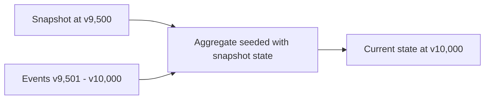

# Event Sourcing: Replaying Events

## Overview

Replay is the mechanism that turns a raw event log into something useful: current state for an aggregate, or a purpose-built read model for a query. This document covers the different situations replay is used for, how to make it fast, and how to keep it working as event shapes change over the life of a system.

See [readme.md](./readme.md) for the pattern overview, and [event-store-design.md](./event-store-design.md) for how events are structured and persisted.

---

## Rebuilding Current State from Event Zero

The simplest form of replay: load every event for an aggregate, in version order, and apply each one to an empty aggregate instance.

```typescript
async function loadAggregate(aggregateId: string): Promise<Order> {
  const events = await eventStore.loadEvents(aggregateId);

  const order = new Order();
  for (const event of events) {
    order.apply(event);
  }
  return order;
}
```

This is correct for any aggregate, at any point in its life, and is the baseline every optimization below is measured against. For a young aggregate with a handful of events, it is also perfectly fast — the cost only becomes a problem once a single aggregate accumulates thousands of events (see [Replay Performance Considerations](#replay-performance-considerations)).

---

## Rebuilding from a Snapshot Plus Subsequent Events

Once an aggregate has a [snapshot](./event-store-design.md#snapshotting-strategy), loading it means restoring the snapshot's state and replaying only the events that happened after it:

```typescript
async function loadAggregateWithSnapshot(aggregateId: string): Promise<Order> {
  const snapshot = await snapshotStore.loadSnapshot(aggregateId);

  const order = snapshot
    ? Order.fromSnapshot(snapshot.state, snapshot.version)
    : new Order();

  const fromVersion = snapshot?.version ?? 0;
  const events = await eventStore.loadEventsFromVersion(aggregateId, fromVersion);

  for (const event of events) {
    order.apply(event);
  }
  return order;
}
```



The result is identical to replaying from event zero — a snapshot is purely a performance optimization, never a change in what "correct" means. If you ever suspect a snapshot is stale or corrupted, the safe fallback is always to delete it and replay from event zero.

---

## Building a Brand-New Projection Retroactively

Because the event log is the complete history, a projection that didn't exist yesterday can still be built with full historical accuracy today — just replay the *entire* stream (across all aggregates of the relevant type) through the new projection's event handlers:

```typescript
async function rebuildProjection(projection: Projection): Promise<void> {
  await projection.clear();

  let processed = 0;
  for await (const event of eventStore.loadAllEvents()) {
    await projection.handle(event);
    processed++;
  }

  console.log(`Rebuilt ${projection.getProjectionName()} from ${processed} events`);
}
```

This is what makes event sourcing valuable beyond just "audit logging" — a new reporting requirement, a new search index, or a new denormalized view for a feature that didn't exist at design time can all be produced without a data migration, because the source data (the events) was always complete.

---

## Replay Performance Considerations

- **Snapshot hot aggregates.** Any aggregate whose event count grows unboundedly over time (a long-lived shopping cart, a years-old bank account) needs snapshotting; short-lived aggregates usually don't.
- **Stream, don't load-all-into-memory.** When replaying across every aggregate to rebuild a projection, use a cursor/async-iterator over the event store rather than materializing the entire history in memory at once.
- **Batch projection writes.** Applying one event at a time to a database-backed projection is far slower than batching writes — group events by aggregate or by a time window and flush in batches during a rebuild.
- **Parallelize by aggregate, not within an aggregate.** Events within one aggregate's stream must be applied strictly in order, but independent aggregates can be replayed concurrently when rebuilding a global projection.
- **Track projection checkpoints.** A projection should record the last event it successfully processed (by global sequence number, not just per-aggregate version) so that after a crash it resumes from where it left off instead of starting over.

---

## Event Schema Versioning and Upcasting

An event written five years ago must still deserialize correctly today, even though the code that produced it — and the shape developers now expect — has moved on. Two complementary strategies handle this:

**Additive changes** (a new optional field) usually need nothing special — give the new field a sensible default when it's missing from an old event.

**Breaking changes** (a renamed field, a restructured payload, splitting one event into two) need an **upcaster**: a function that transforms an old event shape into the current one, applied transparently when the event is loaded.

```typescript
interface EventUpcaster<From, To> {
  canUpcast(eventType: string, version: number): boolean;
  upcast(event: From): To;
}

class OrderPlacedV1ToV2Upcaster implements EventUpcaster<OrderPlacedV1, OrderPlacedV2> {
  canUpcast(eventType: string, version: number): boolean {
    return eventType === 'OrderPlaced' && version === 1;
  }

  upcast(event: OrderPlacedV1): OrderPlacedV2 {
    return {
      ...event,
      // V1 events predate multi-currency support - assume the historical default
      currency: 'USD',
    };
  }
}
```

Upcasters are chained and applied on read, in order (`v1 -> v2 -> v3 -> ...`), so the rest of the codebase — aggregates and projections alike — only ever needs to understand the *current* event shape. The alternative, migrating every historical event row in place, defeats the append-only guarantee that makes the audit trail trustworthy and should be avoided.

---

## Related Documents

- [readme.md](./readme.md) — pattern overview
- [Event Store Design](./event-store-design.md) — event schema, concurrency control, snapshots
- [Example](./example.md) — a worked example showing replay in context
