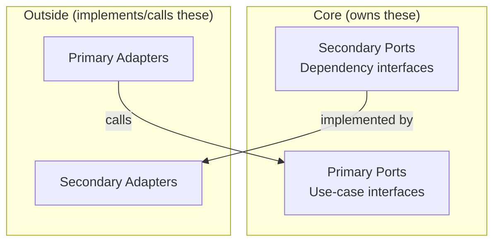
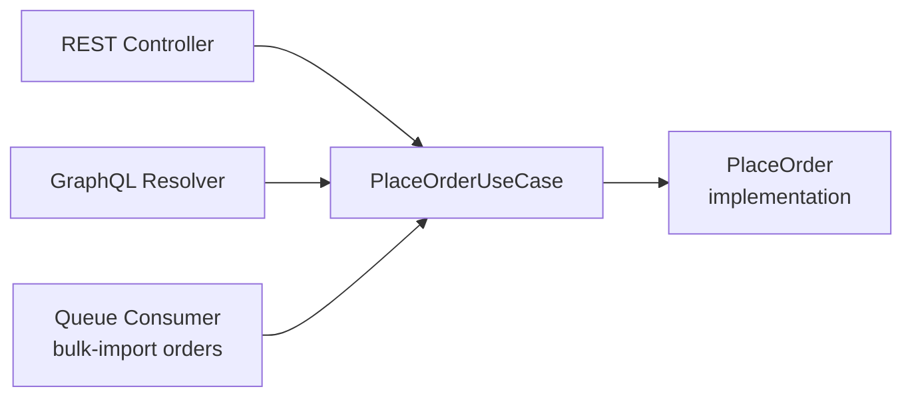

# Hexagonal Architecture: Ports and Adapters

## Overview

This document goes deeper into the two building blocks that give the pattern its name: **ports**, the interfaces the application core defines, and **adapters**, the implementations of (or callers into) those interfaces. Getting the boundary between them right is the entire discipline of hexagonal architecture — everything else is consequence.

## Table of Contents

- [Defining Ports](#defining-ports)
- [Primary (Driving) Ports](#primary-driving-ports)
- [Secondary (Driven) Ports](#secondary-driven-ports)
- [Adapters](#adapters)
- [Swapping Adapters](#swapping-adapters)
- [One Port, Multiple Primary Adapters](#one-port-multiple-primary-adapters)
- [Anti-Patterns](#anti-patterns)
- [Related Documents](#related-documents)

## Defining Ports

A port is owned by the core, expressed purely in terms the domain understands — never in terms of HTTP status codes, SQL rows, or a specific vendor's SDK. A good litmus test: if changing your database vendor, message broker, or web framework would force you to change a port's signature, the port has leaked infrastructure detail into the core.



## Primary (Driving) Ports

A primary port is what the outside world calls *into* the core with. In practice this is almost always a use-case interface: one method (or a small, cohesive set) representing a single thing a user or system can ask the application to do.

```typescript
// core/ports/cancel-order.usecase.ts
export interface CancelOrderUseCase {
  execute(input: CancelOrderInput): Promise<void>;
}

export interface CancelOrderInput {
  orderId: string;
  reason: string;
}
```

Multiple kinds of primary adapters can call the same primary port without the core knowing or caring which one triggered it:

- A REST controller calling `cancelOrder.execute(...)` from an HTTP `DELETE /orders/:id` handler.
- A CLI command calling the same interface from an operator's terminal.
- A scheduled job calling it for orders that have expired.

## Secondary (Driven) Ports

A secondary port is what the core calls *out* to. It should be shaped around what the domain needs conceptually, not around what a particular database's query language happens to make convenient.

```typescript
// core/ports/order-repository.ts
export interface OrderRepository {
  save(order: Order): Promise<void>;
  findById(orderId: string): Promise<Order | null>;
  findPendingOlderThan(cutoff: Date): Promise<Order[]>;
}
```

Notice `findPendingOlderThan` is expressed in domain language ("pending", "older than a cutoff"), not as a raw SQL fragment or a Mongo query object — the adapter is responsible for translating that domain concept into whatever the underlying store requires.

## Adapters

### Primary Adapters

Primary adapters translate an external trigger into a call on a primary port, and translate the result back into whatever format the caller expects:

```typescript
// adapters/primary/http/order-controller.ts
export class OrderController {
  constructor(private readonly cancelOrder: CancelOrderUseCase) {}

  async handleDelete(req: Request, res: Response) {
    await this.cancelOrder.execute({
      orderId: req.params.id,
      reason: req.body.reason ?? "customer_requested",
    });
    res.status(204).send();
  }
}

// adapters/primary/cli/cancel-order-command.ts
export class CancelOrderCommand {
  constructor(private readonly cancelOrder: CancelOrderUseCase) {}

  async run(orderId: string) {
    await this.cancelOrder.execute({ orderId, reason: "operator_cancelled" });
    console.log(`Order ${orderId} cancelled.`);
  }
}
```

### Secondary Adapters

Secondary adapters implement a secondary port against a specific technology:

```typescript
// adapters/secondary/postgres/postgres-order-repository.ts
export class PostgresOrderRepository implements OrderRepository {
  constructor(private readonly db: Pool) {}

  async save(order: Order): Promise<void> { /* INSERT/UPDATE */ }
  async findById(orderId: string): Promise<Order | null> { /* SELECT */ }
  async findPendingOlderThan(cutoff: Date): Promise<Order[]> {
    const { rows } = await this.db.query(
      `SELECT * FROM orders WHERE status = 'pending' AND created_at < $1`,
      [cutoff],
    );
    return rows.map(Order.fromRow);
  }
}

// adapters/secondary/in-memory/in-memory-order-repository.ts
export class InMemoryOrderRepository implements OrderRepository {
  private orders = new Map<string, Order>();

  async save(order: Order): Promise<void> { this.orders.set(order.id, order); }
  async findById(orderId: string): Promise<Order | null> { return this.orders.get(orderId) ?? null; }
  async findPendingOlderThan(cutoff: Date): Promise<Order[]> {
    return [...this.orders.values()].filter(o => o.status === "pending" && o.createdAt < cutoff);
  }
}
```

## Swapping Adapters

Because `PlaceOrder`, `CancelOrder`, and every other use case depend on `OrderRepository` the interface — never `PostgresOrderRepository` the class — swapping the backing store is a one-line change at the composition root:

```typescript
// Production wiring
const orderRepository: OrderRepository = new PostgresOrderRepository(pgPool);

// Test wiring — no database needed
const orderRepository: OrderRepository = new InMemoryOrderRepository();
```

The same applies to a migration: you can stand up a `DynamoOrderRepository` alongside `PostgresOrderRepository`, dual-write during a transition period, and cut over by changing the composition root — the use cases never notice.

## One Port, Multiple Primary Adapters

The same primary port frequently has more than one adapter driving it simultaneously in production, not just in tests:



This is the concrete payoff of the pattern: adding a GraphQL API alongside an existing REST API is "write a new primary adapter," not "duplicate the business logic."

## Anti-Patterns

⚠️ **Anemic ports** — a repository interface that's just a 1:1 mirror of a database table (`insertRow`, `updateRow`, `deleteRow`) isn't a domain abstraction, it's a database client with extra steps. Shape ports around what the domain needs to ask for, not the schema.

⚠️ **Business logic in adapters** — if a controller validates business rules, or a repository decides *when* an order counts as "expired," that logic has leaked out of the core and now lives somewhere it can't be unit tested without infrastructure.

⚠️ **Leaking framework types across the port** — a port signature that accepts an Express `Request` or returns a TypeORM entity has stopped being a port; it now couples the core to a specific framework.

⚠️ **A port per method instead of per capability** — one interface per individual method turns the codebase into indirection for its own sake. Group related operations into a single, cohesive port.

## Related Documents

- **[readme.md](./readme.md)** — the pattern overview and end-to-end example
- **[implementation-notes.md](./implementation-notes.md)** — folder structure and composition-root wiring
- **[testing-strategy.md](./testing-strategy.md)** — testing the core against fake adapters
