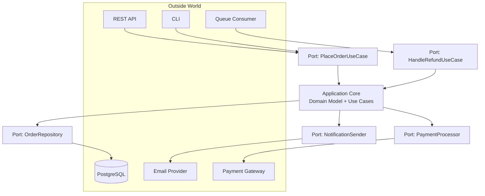
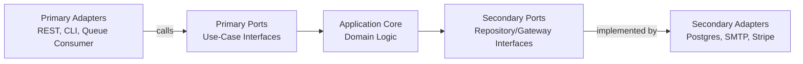
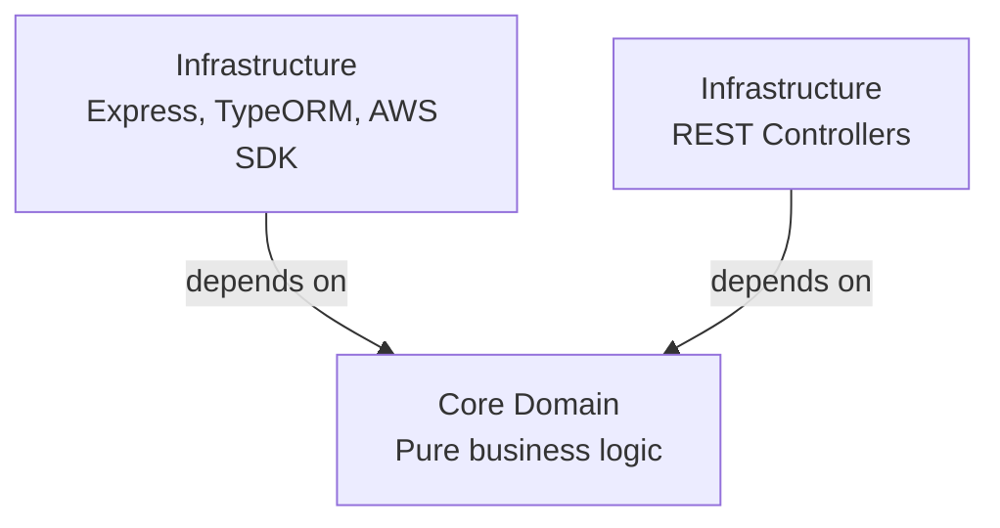

# Hexagonal Architecture

## Overview

Hexagonal Architecture — also known as Ports and Adapters — is a pattern that isolates the core business logic of an application from the technical details of how it is invoked (HTTP, CLI, message queues) and what it depends on (databases, external APIs, file systems). The core defines interfaces ("ports") describing what it needs and what it offers; everything outside the core implements or calls through those interfaces via "adapters". The result is a domain model that has no idea whether it is running behind a REST API or a queue consumer, or whether it is persisted in Postgres or an in-memory map.

## Table of Contents

- [What is Hexagonal Architecture?](#what-is-hexagonal-architecture)
- [Core Domain, Ports, and Adapters](#core-domain-ports-and-adapters)
- [Primary vs. Secondary](#primary-vs-secondary)
- [The Dependency Rule](#the-dependency-rule)
- [Example: An Order Service](#example-an-order-service)
- [Lineage: From Layered to Hexagonal](#lineage-from-layered-to-hexagonal)
- [Benefits](#benefits)
- [Trade-offs](#trade-offs)
- [When to Use](#when-to-use)
- [Related Documents](#related-documents)

## What is Hexagonal Architecture?

Coined by Alistair Cockburn, the "hexagon" is really just a way of drawing the application core so that no single side is privileged — there is no "top" (UI) or "bottom" (database) the way a layered diagram implies. Every external actor, whether it drives the application (a user, a scheduler, another service) or is driven by it (a database, an email provider, a payment gateway), talks to the core only through a **port** — an interface the core itself defines.



## Core Domain, Ports, and Adapters

| Concept | Description | Owned By | Example |
|---|---|---|---|
| **Core / Domain** | Entities, value objects, business rules, use cases | The application itself | `Order`, `PlaceOrderUseCase` |
| **Port** | An interface expressing a capability the core needs or offers | The core | `OrderRepository`, `PlaceOrderUseCase` |
| **Adapter** | A concrete implementation of a port, or a caller of one | The outside world | `PostgresOrderRepository`, `OrderController` |

A port is nothing more than a contract. The core never imports an adapter — adapters import the core's port interfaces and satisfy them. This is what makes the dependency arrows in the diagram above point *inward*, toward the core, from both sides.

## Primary vs. Secondary

Ports and adapters come in two flavors, distinguished by which side initiates the call:

- **Primary (driving) side** — something outside the core *drives* it: a REST controller, a CLI command, a scheduled job, a queue consumer. The core exposes a **primary port** (typically a use-case interface) that these adapters call.
- **Secondary (driven) side** — the core *drives* something outside it: persistence, sending an email, calling a payment provider. The core defines a **secondary port** describing what it needs, and an adapter provides the implementation.



The naming can be confusing at first: a "driving" adapter drives the core forward (it calls in), while a "driven" adapter is driven by the core (the core calls out to it). Both are still adapters; both still depend on a port owned by the core.

## The Dependency Rule

The single rule that makes hexagonal architecture work: **dependencies always point toward the core**. The core never depends on a framework, a database driver, or an HTTP library — it depends only on its own interfaces. Frameworks and infrastructure depend on the core.



This inversion is what lets you replace Express with Fastify, or Postgres with DynamoDB, by writing a new adapter — without touching a single line of domain logic.

## Example: An Order Service

A primary port (a use case the core exposes) and a secondary port (a dependency the core needs), in TypeScript:

```typescript
// core/ports/place-order.usecase.ts  (primary port)
export interface PlaceOrderUseCase {
  execute(input: PlaceOrderInput): Promise<Order>;
}

export interface PlaceOrderInput {
  customerId: string;
  items: { productId: string; quantity: number }[];
}

// core/ports/order-repository.ts  (secondary port)
export interface OrderRepository {
  save(order: Order): Promise<void>;
  findById(orderId: string): Promise<Order | null>;
}

// core/ports/notification-sender.ts  (secondary port)
export interface NotificationSender {
  sendOrderConfirmation(order: Order): Promise<void>;
}
```

The core implements the primary port and depends only on the secondary ports — never on a concrete database or email library:

```typescript
// core/use-cases/place-order.ts
export class PlaceOrder implements PlaceOrderUseCase {
  constructor(
    private readonly orders: OrderRepository,
    private readonly notifications: NotificationSender,
  ) {}

  async execute(input: PlaceOrderInput): Promise<Order> {
    const order = Order.create(input.customerId, input.items);
    await this.orders.save(order);
    await this.notifications.sendOrderConfirmation(order);
    return order;
  }
}
```

A primary adapter (REST controller) calls the port; it does not know how orders are stored or how confirmations are sent:

```typescript
// adapters/primary/http/order-controller.ts
export class OrderController {
  constructor(private readonly placeOrder: PlaceOrderUseCase) {}

  async handlePost(req: Request, res: Response) {
    const order = await this.placeOrder.execute({
      customerId: req.body.customerId,
      items: req.body.items,
    });
    res.status(201).json(order);
  }
}
```

A secondary adapter implements the storage port against a real database:

```typescript
// adapters/secondary/postgres/postgres-order-repository.ts
export class PostgresOrderRepository implements OrderRepository {
  constructor(private readonly db: Pool) {}

  async save(order: Order): Promise<void> {
    await this.db.query(
      `INSERT INTO orders (id, customer_id, items, status) VALUES ($1, $2, $3, $4)`,
      [order.id, order.customerId, JSON.stringify(order.items), order.status],
    );
  }

  async findById(orderId: string): Promise<Order | null> {
    const { rows } = await this.db.query(`SELECT * FROM orders WHERE id = $1`, [orderId]);
    return rows[0] ? Order.fromRow(rows[0]) : null;
  }
}
```

Composition happens once, at the edge of the application (the composition root), wiring concrete adapters into the core:

```typescript
// composition-root.ts
const db = new Pool({ connectionString: process.env.DATABASE_URL });
const orderRepository = new PostgresOrderRepository(db);
const notificationSender = new SmtpNotificationSender(smtpConfig);

const placeOrder = new PlaceOrder(orderRepository, notificationSender);
const orderController = new OrderController(placeOrder);
```

Swapping `PostgresOrderRepository` for an `InMemoryOrderRepository` in a test, or for a `DynamoOrderRepository` in production, requires touching only this wiring — never `PlaceOrder` itself.

## Lineage: From Layered to Hexagonal

Hexagonal architecture did not appear in a vacuum — it is one point on a spectrum of patterns that all push toward the same goal: keeping business logic independent of infrastructure. The [Layered Architecture](../02-layered-architecture/readme.md) pattern already separates presentation, application, domain, and infrastructure layers, but layered dependencies conventionally flow *downward* (presentation → domain → infrastructure), which still lets the domain layer end up depending on infrastructure interfaces defined in the layer below it. Hexagonal (and its close relatives, Onion and Clean Architecture) inverts that: infrastructure depends on the domain, never the reverse. If you already have a well-factored layered application, moving to hexagonal is often a matter of extracting your domain-layer dependencies into interfaces the domain owns, rather than a full rewrite.

## Benefits

✅ **Testability** — the core can be unit tested against fakes with no database, network, or framework involved
✅ **Flexibility** — swap a REST API for a queue consumer, or Postgres for DynamoDB, without touching the core
✅ **Independence** — business logic has zero compile-time dependency on any framework
✅ **Maintainability** — the boundary between "what the business does" and "how it's wired up" is explicit
✅ **Technology agnostic core** — the same domain model can be exposed over HTTP, gRPC, and a CLI simultaneously

## Trade-offs

⚠️ **More upfront ceremony** — defining an interface for every dependency is more code than calling a database client directly
⚠️ **Indirection** — new contributors have to learn to trace calls through interfaces rather than concrete classes
⚠️ **Easy to do badly** — "anemic" ports that just mirror a database schema, or adapters that sneak business logic in, erase most of the benefit
⚠️ **Overkill for small services** — a CRUD microservice with one database and no plausible reason to swap it may not need the indirection

## When to Use

Hexagonal architecture pays off when a system has non-trivial business logic that needs to outlive specific technology choices — long-lived domain services, systems expected to support multiple delivery channels (web, mobile API, batch jobs) against the same use cases, or codebases where testability of business rules matters more than minimizing boilerplate. It is a poor fit for thin CRUD services where the "business logic" is essentially "validate and save."

## Related Documents

- **[ports-and-adapters.md](./ports-and-adapters.md)** — a deeper look at defining and swapping ports and adapters
- **[implementation-notes.md](./implementation-notes.md)** — folder structure, composition root, and common pitfalls
- **[testing-strategy.md](./testing-strategy.md)** — how the pattern shapes your test pyramid

## Further Reading

- [Layered Architecture](../02-layered-architecture/readme.md) — the pattern hexagonal architecture builds on and inverts
- [Microservices Architecture](../03-microservices/readme.md) — hexagonal architecture is commonly used *inside* each service in a microservices system

---

**Last Updated**: October 2025
**Maintainer**: System Design Team
