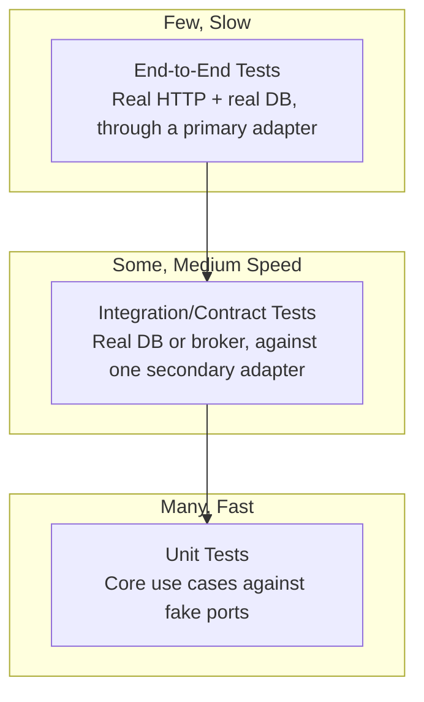

# Hexagonal Architecture: Testing Strategy

## Overview

The single biggest practical payoff of hexagonal architecture is how it reshapes testing: because the core depends only on interfaces it owns, the vast majority of business-logic tests never need a database, a network call, or a running framework. This document lays out which kind of test belongs at which boundary.

## Table of Contents

- [Testing Pyramid for Hexagonal Apps](#testing-pyramid-for-hexagonal-apps)
- [Unit Testing the Core](#unit-testing-the-core)
- [Contract Tests for Adapters](#contract-tests-for-adapters)
- [Integration Tests for Secondary Adapters](#integration-tests-for-secondary-adapters)
- [End-to-End Tests via Primary Adapters](#end-to-end-tests-via-primary-adapters)
- [Test Doubles Strategy](#test-doubles-strategy)
- [Related Documents](#related-documents)

## Testing Pyramid for Hexagonal Apps



Hexagonal architecture doesn't invent a new kind of test — it makes the pyramid's shape achievable, because the core is testable in isolation by construction rather than by discipline alone.

## Unit Testing the Core

Use cases are tested against hand-written or generated fakes of their secondary ports — no database, no HTTP server, no test containers:

```typescript
describe("PlaceOrder", () => {
  it("saves the order and sends a confirmation", async () => {
    const orders = new InMemoryOrderRepository();
    const notifications = new FakeNotificationSender();
    const placeOrder = new PlaceOrder(orders, notifications);

    const order = await placeOrder.execute({
      customerId: "cust-1",
      items: [{ productId: "sku-1", quantity: 2 }],
    });

    expect(await orders.findById(order.id)).toEqual(order);
    expect(notifications.sentTo(order.customerId)).toBe(true);
  });

  it("rejects an order with no items", async () => {
    const placeOrder = new PlaceOrder(new InMemoryOrderRepository(), new FakeNotificationSender());
    await expect(placeOrder.execute({ customerId: "cust-1", items: [] }))
      .rejects.toThrow("Order must contain at least one item");
  });
});
```

These tests run in milliseconds, exercise every business rule, and never break because a CI database container was slow to start.

## Contract Tests for Adapters

A contract test asserts that every implementation of a port — real or fake — honors the same behavioral contract, so a fake used in unit tests can't silently drift from what the real adapter actually does:

```typescript
// order-repository.contract.ts — run against every implementation
export function orderRepositoryContractTests(makeRepository: () => OrderRepository) {
  describe("OrderRepository contract", () => {
    it("returns null for an unknown order", async () => {
      const repo = makeRepository();
      expect(await repo.findById("does-not-exist")).toBeNull();
    });

    it("returns a saved order by id", async () => {
      const repo = makeRepository();
      const order = Order.create("cust-1", [{ productId: "sku-1", quantity: 1 }]);
      await repo.save(order);
      expect(await repo.findById(order.id)).toEqual(order);
    });
  });
}

// postgres-order-repository.test.ts
orderRepositoryContractTests(() => new PostgresOrderRepository(testDb));

// in-memory-order-repository.test.ts
orderRepositoryContractTests(() => new InMemoryOrderRepository());
```

If `InMemoryOrderRepository` and `PostgresOrderRepository` both pass the same suite, unit tests written against the in-memory fake are trustworthy stand-ins for the real thing.

## Integration Tests for Secondary Adapters

Beyond the shared contract, each secondary adapter needs its own tests against the real technology it wraps — a real (or containerized) Postgres instance, a real SMTP sandbox, a real payment provider's test mode — to catch things a contract test can't: connection handling, query correctness, serialization edge cases, timeouts.

```typescript
describe("PostgresOrderRepository (integration)", () => {
  it("persists items as JSON and reconstructs them correctly", async () => {
    const repo = new PostgresOrderRepository(testDb);
    const order = Order.create("cust-1", [{ productId: "sku-1", quantity: 3 }]);
    await repo.save(order);

    const reloaded = await repo.findById(order.id);
    expect(reloaded?.items).toEqual(order.items);
  });
});
```

## End-to-End Tests via Primary Adapters

A small number of tests should exercise the full stack through a real primary adapter (an actual HTTP request against a running server, backed by a real or realistic database) to catch wiring mistakes the composition root could introduce — a use case built with the wrong adapter, a route bound to the wrong handler.

```typescript
describe("POST /orders (e2e)", () => {
  it("creates an order and returns 201", async () => {
    const app = buildApp(testConfig); // real composition root, test database
    const response = await request(app)
      .post("/orders")
      .send({ customerId: "cust-1", items: [{ productId: "sku-1", quantity: 1 }] });

    expect(response.status).toBe(201);
    expect(response.body.customerId).toBe("cust-1");
  });
});
```

Keep this layer small deliberately — its job is to catch integration mistakes, not to re-verify business rules already covered by fast unit tests.

## Test Doubles Strategy

| Test Level | Core Double Used | Secondary Adapter Under Test | Speed |
|---|---|---|---|
| Unit (core) | In-memory / fake ports | None — core only | Milliseconds |
| Contract | N/A | Every implementation, same suite | Fast–Medium |
| Integration | N/A | One real adapter vs. real infra | Medium–Slow |
| End-to-end | None — full composition root | All, wired together | Slow |

## Related Documents

- **[readme.md](./readme.md)** — pattern overview and worked example
- **[ports-and-adapters.md](./ports-and-adapters.md)** — the port/adapter definitions these tests exercise
- **[implementation-notes.md](./implementation-notes.md)** — the folder structure and composition root referenced above
