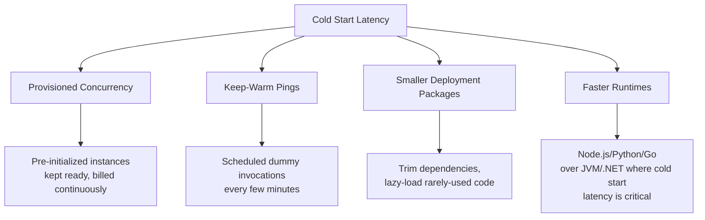
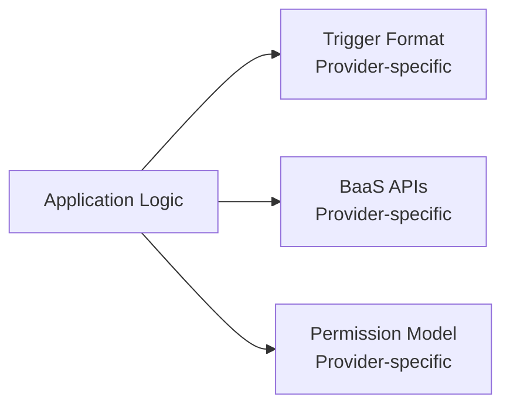
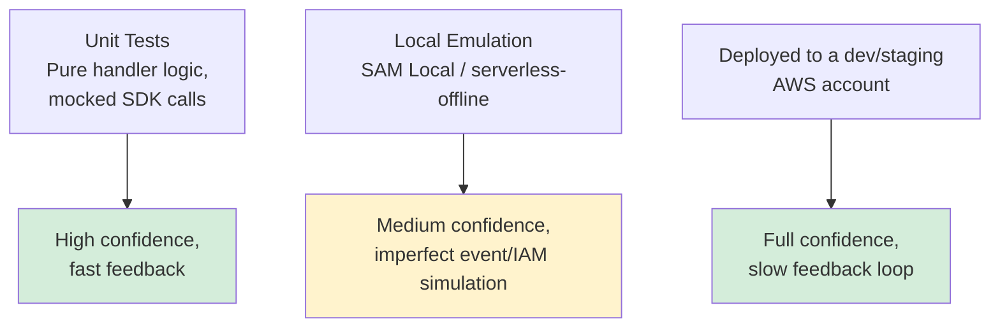
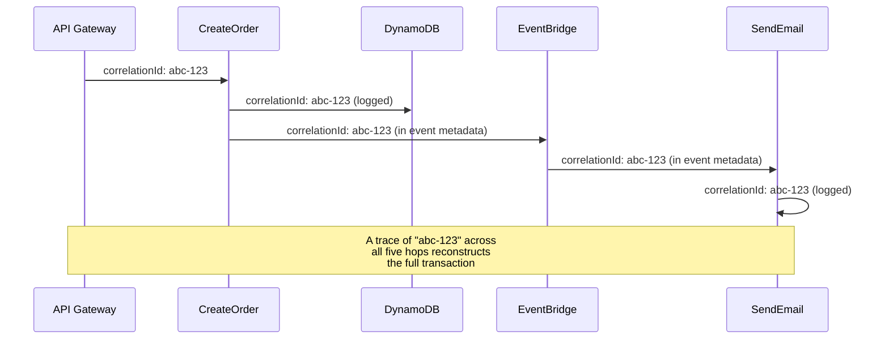
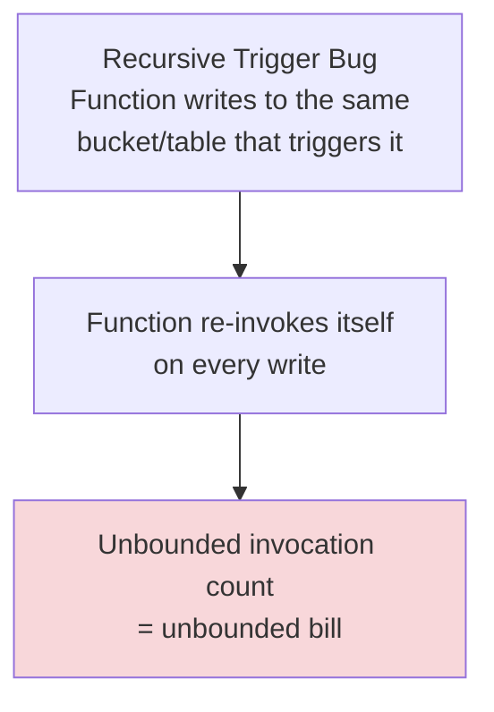

# Serverless: Common Challenges

## Overview

Serverless removes infrastructure-management problems and introduces a different set of operational problems in their place. This document covers the challenges teams most commonly hit in production — cold starts, vendor lock-in, testing difficulty, distributed observability, platform limits, and cost unpredictability — and the mitigations for each.

## Table of Contents

- [Cold Starts and Mitigation](#cold-starts-and-mitigation)
- [Vendor Lock-in and Portability](#vendor-lock-in-and-portability)
- [Testing and Local Development](#testing-and-local-development)
- [Distributed Observability](#distributed-observability)
- [Execution Time and Payload Limits](#execution-time-and-payload-limits)
- [Cost Unpredictability at Scale](#cost-unpredictability-at-scale)

## Cold Starts and Mitigation

Covered conceptually in [readme.md](./readme.md#the-cold-start); this section focuses on mitigation.



**Provisioned concurrency** keeps a specified number of execution environments initialized and ready at all times, eliminating cold starts for that reserved capacity — at the cost of paying for it whether or not it's invoked, which partially offsets serverless's pay-per-use advantage.

```yaml
functions:
  createOrder:
    handler: createOrder.handler
    provisionedConcurrency: 5   # 5 warm instances always ready
```

**Keep-warm pings** — a scheduled event invoking the function every few minutes to prevent it from going idle — is a cheaper but less reliable alternative; it doesn't help under sudden concurrency spikes beyond the number of instances being pinged.

**Smaller deployment packages** reduce the amount of code the platform has to download and initialize. Bundling with a tool that tree-shakes unused code, and lazy-loading SDK clients only used by rarely-hit code paths, both shrink cold-start time.

## Vendor Lock-in and Portability



**Mitigation strategies:**
- Keep business logic in plain functions that receive already-parsed input, and put the provider-specific event-parsing at a thin boundary layer — this makes the core logic testable and, to a degree, portable
- Use an abstraction library (e.g. the Serverless Framework's or SST's cross-provider primitives) if multi-cloud portability is a hard requirement, understanding this trades away some provider-specific features
- Accept that deep integration with a provider's event sources (DynamoDB Streams, EventBridge rules, Step Functions) is usually a deliberate one-way door — evaluate lock-in risk against the productivity gained from using managed services fully, rather than trying to abstract everything preemptively

## Testing and Local Development



**Practical approach:**
1. Keep the handler function thin — parse the trigger event, call a plain, framework-agnostic function with the extracted arguments, and unit-test that plain function in isolation with mocked AWS SDK clients
2. Use local emulation tools (AWS SAM Local, `serverless-offline`) for a fast inner-loop check of routing and event-shape wiring, while accepting they don't perfectly replicate IAM permission errors, cold-start behavior, or exact timeout semantics
3. Maintain a real dev/staging cloud environment for integration tests that must exercise actual managed-service behavior (DynamoDB conditional writes, S3 event delivery ordering, IAM policy enforcement)

## Distributed Observability

A single business transaction routinely spans several functions plus managed services (API Gateway → Lambda → DynamoDB → EventBridge → Lambda → SES), and there's no single process or log file to inspect.



**Mitigation:**
- Generate a correlation ID at the entry point and propagate it through every downstream call and event payload
- Adopt distributed tracing (AWS X-Ray, OpenTelemetry) so trace spans link automatically across function and service boundaries instead of relying purely on manually-grepped correlation IDs
- Centralize structured logs (JSON, not free text) into one searchable store (CloudWatch Logs Insights, an ELK stack) so a single query can pull every log line for one correlation ID across every function

## Execution Time and Payload Limits

| Constraint | Typical Limit (AWS Lambda) | Consequence |
|---|---|---|
| Max execution duration | 15 minutes | Long jobs must be chunked or moved off FaaS |
| Synchronous payload size | 6 MB | Large request/response bodies need S3 + a reference, not inline data |
| Asynchronous payload size | 256 KB | Event payloads should carry IDs/references, not full objects |
| Deployment package size | 250 MB unzipped (extendable via container images) | Heavy dependencies push toward container-image-packaged functions |
| Concurrent executions per account/region | Default account limit, raisable | Sudden bursts beyond the limit are throttled unless pre-requested |

**Mitigation:** for workloads that risk hitting the duration limit, split the work across a Step Functions/Durable Functions workflow (see [workflow.md](./workflow.md#orchestrated-multi-function-business-process)) so each step stays comfortably under the ceiling, or move the workload to a container/batch service entirely when it's fundamentally not a short, bursty unit of work.

## Cost Unpredictability at Scale



**Common cost pitfalls:**
- **Recursive triggers** — a function's own output lands in the same event source that triggers it (see the S3 prefix-scoping example in [exmples.md](./exmples.md#example-2-image-processing-pipeline))
- **Over-provisioned memory** — memory allocation also scales the proportional CPU allocated and the per-GB-second price; profiling actual usage and right-sizing avoids paying for unused headroom
- **Chatty inter-function calls** — synchronous function-to-function calls multiply invocation count and latency; prefer direct calls to the shared backend service, or asynchronous events, over one function invoking another purely to fetch data
- **Sustained high, predictable volume** — beyond a certain steady request rate, reserved-capacity compute (containers with committed-use pricing) becomes cheaper than per-invocation billing; this crossover point is worth calculating explicitly rather than assumed, as covered in [pros-cons.md](./pros-cons.md#decision-matrix)

## Related Documents

- **[readme.md](./readme.md)**: Architecture overview
- **[workflow.md](./workflow.md)**: Execution patterns
- **[pros-cons.md](./pros-cons.md)**: Trade-offs and decision matrix
- **[exmples.md](./exmples.md)**: Worked implementation examples
