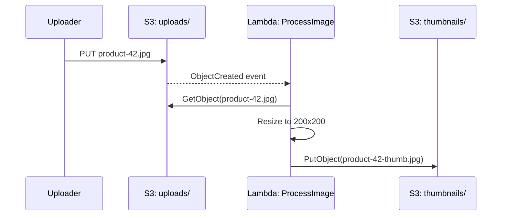
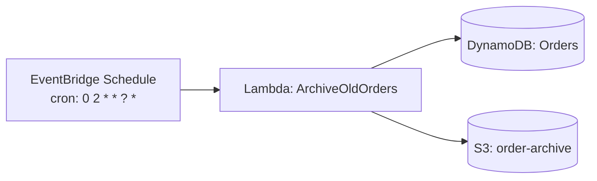

# Serverless: Implementation Examples

## Overview

This document walks through three worked serverless examples — a REST API endpoint, an image-processing pipeline triggered by object storage, and a scheduled job — each with function code and its accompanying infrastructure-as-code definition. Examples use AWS Lambda with the Serverless Framework, consistent with the stack used in [readme.md](./readme.md) and the top-level [architecture-patterns README](../README.md#serverless-architecture).

## Table of Contents

- [Example 1: REST API Endpoint](#example-1-rest-api-endpoint)
- [Example 2: Image-Processing Pipeline](#example-2-image-processing-pipeline)
- [Example 3: Scheduled Job](#example-3-scheduled-job)

## Example 1: REST API Endpoint

A `GET /orders/{orderId}` endpoint backed by a single function and DynamoDB.

```mermaid
graph LR
    Client --> AG[API Gateway<br/>GET /orders/{orderId}]
    AG --> L[Lambda: GetOrder]
    L --> DB[(DynamoDB: Orders)]
```

**Function code:**

```javascript
// getOrder.js
const { DynamoDBClient, GetItemCommand } = require('@aws-sdk/client-dynamodb');
const { unmarshall } = require('@aws-sdk/util-dynamodb');

// Module-level init — runs once per cold start, reused on warm invocations
const client = new DynamoDBClient({});

exports.handler = async (event) => {
  const { orderId } = event.pathParameters;

  const result = await client.send(new GetItemCommand({
    TableName: process.env.ORDERS_TABLE,
    Key: { orderId: { S: orderId } },
  }));

  if (!result.Item) {
    return { statusCode: 404, body: JSON.stringify({ error: 'Order not found' }) };
  }

  return {
    statusCode: 200,
    headers: { 'Content-Type': 'application/json' },
    body: JSON.stringify(unmarshall(result.Item)),
  };
};
```

**Infrastructure (Serverless Framework):**

```yaml
service: order-api

provider:
  name: aws
  runtime: nodejs18.x
  environment:
    ORDERS_TABLE: ${self:service}-${sls:stage}-orders

functions:
  getOrder:
    handler: getOrder.handler
    events:
      - httpApi:
          path: /orders/{orderId}
          method: get
    iamRoleStatements:
      - Effect: Allow
        Action: dynamodb:GetItem
        Resource: !GetAtt OrdersTable.Arn

resources:
  Resources:
    OrdersTable:
      Type: AWS::DynamoDB::Table
      Properties:
        TableName: ${self:provider.environment.ORDERS_TABLE}
        AttributeDefinitions:
          - AttributeName: orderId
            AttributeType: S
        KeySchema:
          - AttributeName: orderId
            KeyType: HASH
        BillingMode: PAY_PER_REQUEST
```

## Example 2: Image-Processing Pipeline

An uploaded product image triggers a function that generates a thumbnail and stores it back in S3.



**Function code:**

```javascript
// processImage.js
const { S3Client, GetObjectCommand, PutObjectCommand } = require('@aws-sdk/client-s3');
const sharp = require('sharp');

const s3 = new S3Client({});

exports.handler = async (event) => {
  for (const record of event.Records) {
    const bucket = record.s3.bucket.name;
    const key = decodeURIComponent(record.s3.object.key.replace(/\+/g, ' '));

    const original = await s3.send(new GetObjectCommand({ Bucket: bucket, Key: key }));
    const buffer = await streamToBuffer(original.Body);

    const thumbnail = await sharp(buffer)
      .resize(200, 200, { fit: 'cover' })
      .jpeg({ quality: 80 })
      .toBuffer();

    const thumbKey = key.replace('uploads/', 'thumbnails/').replace(/\.\w+$/, '-thumb.jpg');

    await s3.send(new PutObjectCommand({
      Bucket: bucket,
      Key: thumbKey,
      Body: thumbnail,
      ContentType: 'image/jpeg',
    }));
  }
};

async function streamToBuffer(stream) {
  const chunks = [];
  for await (const chunk of stream) chunks.push(chunk);
  return Buffer.concat(chunks);
}
```

**Infrastructure (Serverless Framework):**

```yaml
service: image-pipeline

provider:
  name: aws
  runtime: nodejs18.x
  timeout: 30
  memorySize: 512

functions:
  processImage:
    handler: processImage.handler
    events:
      - s3:
          bucket: product-images
          event: s3:ObjectCreated:*
          rules:
            - prefix: uploads/
    iamRoleStatements:
      - Effect: Allow
        Action: [s3:GetObject, s3:PutObject]
        Resource: arn:aws:s3:::product-images/*
```

Note the trigger is scoped to the `uploads/` prefix and the function writes to `thumbnails/` — without this, the function's own output would re-trigger itself in an infinite loop, a common serverless pitfall covered further in [challenges.md](./challenges.md).

## Example 3: Scheduled Job

A nightly job that archives orders older than 90 days, triggered on a cron schedule rather than an HTTP request or an upstream event.



**Function code:**

```javascript
// archiveOldOrders.js
const { DynamoDBClient, ScanCommand, DeleteItemCommand } = require('@aws-sdk/client-dynamodb');
const { S3Client, PutObjectCommand } = require('@aws-sdk/client-s3');
const { unmarshall } = require('@aws-sdk/util-dynamodb');

const ddb = new DynamoDBClient({});
const s3 = new S3Client({});
const CUTOFF_DAYS = 90;

exports.handler = async () => {
  const cutoff = Date.now() - CUTOFF_DAYS * 24 * 60 * 60 * 1000;

  const scan = await ddb.send(new ScanCommand({
    TableName: process.env.ORDERS_TABLE,
    FilterExpression: 'createdAt < :cutoff',
    ExpressionAttributeValues: { ':cutoff': { N: String(cutoff) } },
  }));

  const orders = (scan.Items || []).map(unmarshall);

  if (orders.length > 0) {
    await s3.send(new PutObjectCommand({
      Bucket: process.env.ARCHIVE_BUCKET,
      Key: `orders-${new Date().toISOString().slice(0, 10)}.json`,
      Body: JSON.stringify(orders),
      ContentType: 'application/json',
    }));

    for (const order of orders) {
      await ddb.send(new DeleteItemCommand({
        TableName: process.env.ORDERS_TABLE,
        Key: { orderId: { S: order.orderId } },
      }));
    }
  }

  return { archived: orders.length };
};
```

**Infrastructure (Serverless Framework):**

```yaml
service: order-archival

provider:
  name: aws
  runtime: nodejs18.x
  timeout: 300
  environment:
    ORDERS_TABLE: orders
    ARCHIVE_BUCKET: order-archive

functions:
  archiveOldOrders:
    handler: archiveOldOrders.handler
    events:
      - schedule: cron(0 2 * * ? *)   # every day at 02:00 UTC
    iamRoleStatements:
      - Effect: Allow
        Action: [dynamodb:Scan, dynamodb:DeleteItem]
        Resource: arn:aws:dynamodb:*:*:table/orders
      - Effect: Allow
        Action: s3:PutObject
        Resource: arn:aws:s3:::order-archive/*
```

Because this function has no caller waiting on a response, its timeout can safely be set much higher (300 seconds here) than a synchronous API endpoint would tolerate — the tradeoff discussed under execution limits in [pros-cons.md](./pros-cons.md#3-execution-time-and-payload-limits).

## Related Documents

- **[readme.md](./readme.md)**: Architecture overview
- **[workflow.md](./workflow.md)**: Execution patterns behind these examples
- **[pros-cons.md](./pros-cons.md)**: Trade-offs to weigh before choosing this pattern
- **[challenges.md](./challenges.md)**: Pitfalls encountered when running examples like these in production
