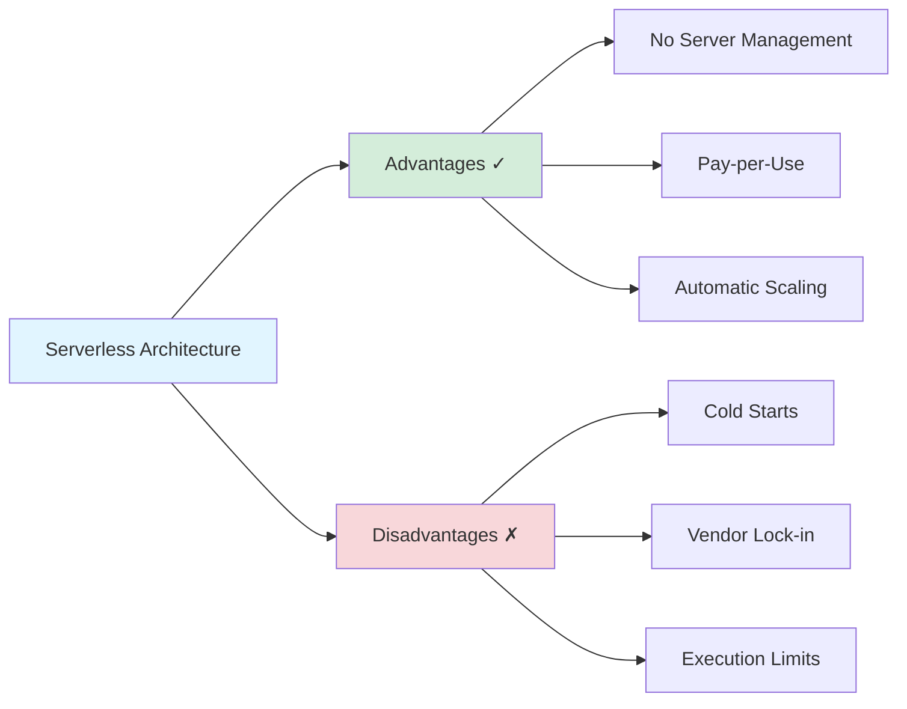
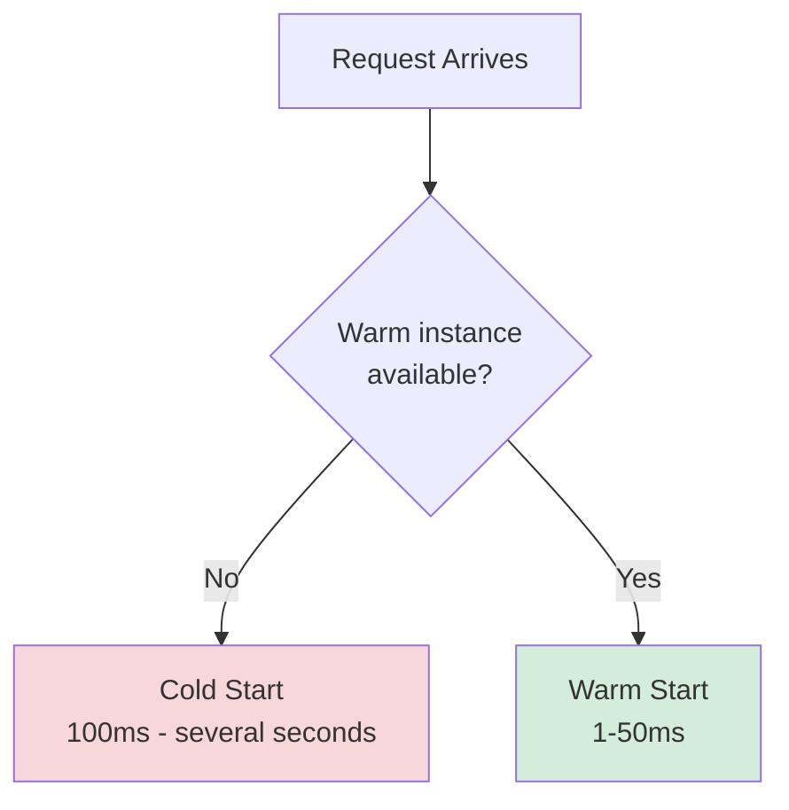
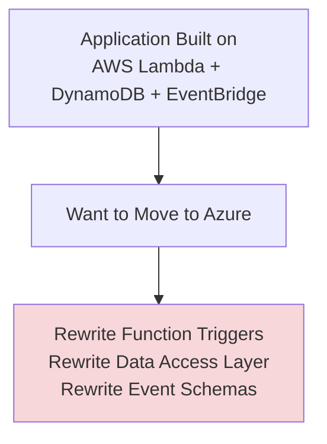
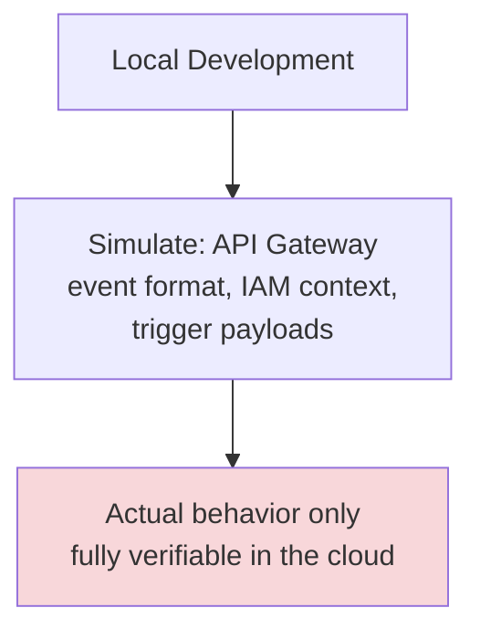
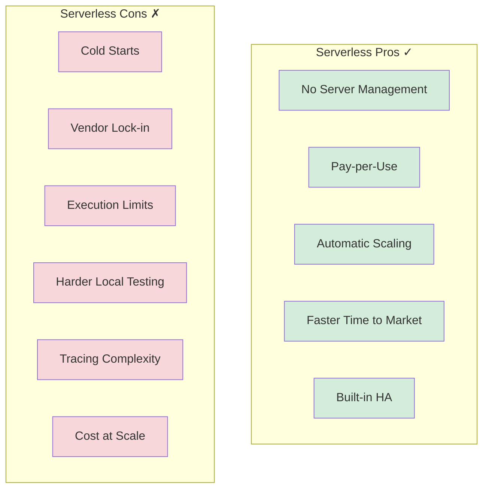

# Serverless Architecture: Pros and Cons

## Overview

This document provides a comprehensive analysis of the advantages and disadvantages of serverless architecture to help you make informed architectural decisions.



---

## Advantages ✓

### 1. No Server Management


**Benefits:**
- No OS patching, no capacity planning, no fleet management
- No load balancer configuration for compute — the platform handles routing and scaling
- Smaller operations team needed to run the same workload
- Faster time from code to production

### 2. Pay-per-Use Pricing

**Benefits:**
- Billed per invocation and per unit of execution time (e.g. per GB-second), not per hour of idle server time
- Near-zero cost for near-zero traffic — no bill for capacity nobody used overnight
- Costs scale roughly linearly with actual usage rather than provisioned peak capacity

**Example:**
```
Traditional: 3 EC2 instances running 24/7 = ~2,160 instance-hours/month
             regardless of whether traffic is 10 req/s or 0.1 req/s

Serverless:  1,000,000 invocations/month × 200ms avg × 512MB
             = billed only for that exact compute-time, nothing else
```

### 3. Automatic, Near-Instant Scaling


**Benefits:**
- No pre-provisioned capacity or auto-scaling group thresholds to tune
- Scales down to zero when there's no traffic
- Absorbs unpredictable bursts (flash sales, viral traffic) without manual intervention

### 4. Faster Time to Market

**Benefits:**
- Small, independently deployable functions reduce the surface area of each change
- No infrastructure provisioning step between "code is ready" and "code is live"
- Managed BaaS services (auth, storage, queues) remove entire categories of code teams would otherwise build and operate themselves

### 5. Built-In High Availability

**Benefits:**
- Functions are deployed across multiple availability zones by the platform by default
- No manual failover configuration for the compute layer
- The provider, not your team, is responsible for the underlying infrastructure's uptime

---

## Disadvantages ✗

### 1. Cold Starts



**Problems:**
- Adds unpredictable latency to the first request after idle periods
- Worse for languages with heavier runtime startup (JVM, .NET) than for Node.js/Python
- Harder to reason about tail latency (p99) than a warm, always-running server

**Mitigation:** provisioned concurrency, smaller deployment packages — see [challenges.md](./challenges.md#cold-starts-and-mitigation).

### 2. Vendor Lock-in



**Problems:**
- Function trigger formats, IAM/permission models, and BaaS APIs differ across providers
- Deep integration with provider-specific services (DynamoDB Streams, EventBridge rules) is hard to port
- Multi-cloud abstraction frameworks add their own complexity and lowest-common-denominator limitations

### 3. Execution Time and Payload Limits

**Problems:**
- Most FaaS platforms cap execution duration (e.g. 15 minutes on AWS Lambda) — long-running jobs must be split or moved off-platform
- Request/response payload sizes are capped (e.g. 6MB synchronous on Lambda)
- Concurrent execution limits per account/region can throttle unexpected bursts unless raised in advance

**Example:**
```
Video transcoding job: needs 45 minutes of CPU time
Lambda max: 15 minutes
Result: must be re-architected as multiple chained functions,
        or moved to a container/batch service entirely
```

### 4. Harder Local Testing and Debugging



**Problems:**
- Emulating the exact event shapes, IAM permissions, and timeout behavior of the cloud environment locally is imperfect
- Attaching a debugger to a live, cloud-invoked function is not straightforward
- Integration tests often need to run against real (or emulated) cloud services to be meaningful

### 5. Distributed Tracing Complexity

**Problems:**
- A single business transaction can span a dozen small functions and managed services
- Correlating logs and traces across all of them requires disciplined use of correlation IDs and a tracing tool (AWS X-Ray, OpenTelemetry)
- Debugging "why did this order fail" means reconstructing a distributed trace rather than reading one stack trace

### 6. Cost Unpredictability at Sustained High Volume

**Problems:**
- Per-invocation pricing that's cheap at low/variable volume can exceed the cost of reserved capacity at sustained high, predictable volume
- Easy to under-estimate cost impact of chatty inter-function calls or oversized memory allocations
- Runaway recursive triggers (a function that re-triggers itself via the same event source) can produce surprising bills

---

## Side-by-Side Comparison



---

## Decision Matrix

| Factor | Serverless Score (1-5) | Notes |
|--------|------------------------|-------|
| Operational Overhead | 5 | No servers to patch or scale manually |
| Cost at Low/Variable Load | 5 | Pay only for what's used |
| Cost at Sustained High Load | 2 | Reserved capacity often cheaper |
| Latency Predictability | 3 | Cold starts introduce tail latency |
| Portability | 2 | Deep provider integration by design |
| Long-Running Workloads | 1 | Hard execution-time ceilings |
| Local Dev Experience | 2 | Cloud environment is hard to fully emulate |

## Summary

### When Pros Outweigh Cons ✓
- Variable, spiky, or unpredictable traffic
- Event-driven glue code between managed services
- Small teams wanting to avoid infrastructure operations
- Short-lived, well-bounded units of work

### When Cons Outweigh Pros ✗
- Long-running or CPU-bound sustained workloads
- Strict, consistent low-latency requirements without budget for provisioned concurrency
- Multi-cloud or on-prem portability is a hard requirement
- Deep, complex distributed transactions that are easier to reason about as a single service

## Related Documents

- **[readme.md](./readme.md)**: Architecture overview
- **[workflow.md](./workflow.md)**: Execution patterns
- **[exmples.md](./exmples.md)**: Worked implementation examples
- **[challenges.md](./challenges.md)**: Common issues and mitigations

---

**Last Updated**: October 2025
**Maintainer**: System Design Team
