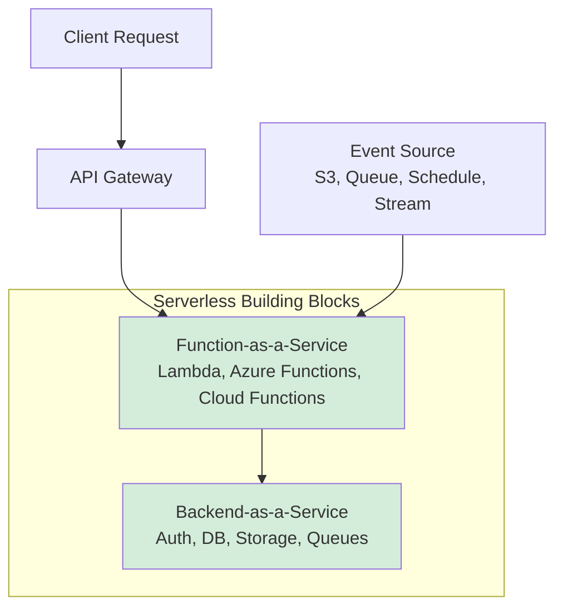
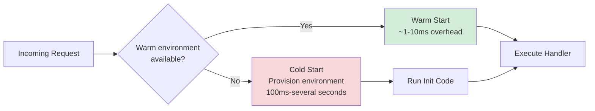
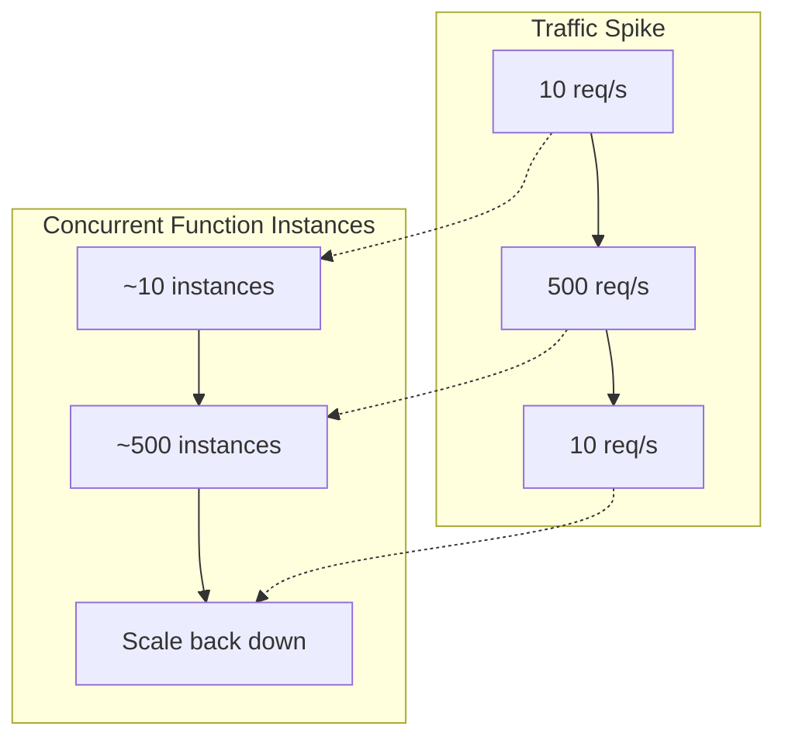

# Serverless Architecture

## Overview

Serverless architecture builds applications from managed, auto-scaling compute and backend services rather than servers you provision and operate yourself. "Serverless" doesn't mean there are no servers — it means the cloud provider owns capacity planning, patching, and scaling, and you pay only for the compute time and requests you actually consume. The two building blocks are **Function-as-a-Service (FaaS)** — short-lived, stateless functions triggered by events (AWS Lambda, Azure Functions, Google Cloud Functions) — and **Backend-as-a-Service (BaaS)** — fully managed services such as authentication, databases, storage, and messaging that an application calls directly instead of running its own middleware for them (Cognito, DynamoDB, S3, EventBridge).

## Table of Contents

- [Core Concepts](#core-concepts)
- [FaaS vs BaaS](#faas-vs-baas)
- [The Cold Start](#the-cold-start)
- [Statelessness Between Invocations](#statelessness-between-invocations)
- [Auto-Scaling Model](#auto-scaling-model)
- [When Serverless Fits](#when-serverless-fits)
- [When Serverless Doesn't Fit](#when-serverless-doesnt-fit)
- [Related Documents](#related-documents)
- [Further Reading](#further-reading)

## Core Concepts



Running example used throughout this pattern's documentation: an order-processing API where `POST /orders` invokes a `CreateOrder` function that writes to DynamoDB and publishes an `OrderCreated` event, which a separate `SendEmail` function consumes asynchronously via EventBridge. See the [top-level architecture-patterns README](../README.md#serverless-architecture) for the full component diagram and AWS/Azure equivalence table.

## FaaS vs BaaS

| Aspect | FaaS | BaaS |
|--------|------|------|
| **What you write** | Business logic in a function handler | Nothing — you configure and call a managed service |
| **Examples** | AWS Lambda, Azure Functions, Google Cloud Functions | Auth0/Cognito, Firebase, DynamoDB, S3, Stripe |
| **Invocation** | Triggered by an event (HTTP, queue message, schedule, object upload) | Called directly via SDK/API from client or another function |
| **State** | Stateless between invocations | Owns and persists its own state |
| **Typical role** | Glue code and business rules | Persistence, identity, storage, third-party integrations |

Most real serverless systems combine both: FaaS functions act as the orchestration and business-logic layer sitting between the client and a set of BaaS services.

## The Cold Start

A cloud provider does not keep an idle function's execution environment running indefinitely. When a function hasn't been invoked recently, the platform must provision a fresh execution environment — download the code, start the runtime, initialize the handler — before it can process the request. This first-invocation latency is a **cold start**; a request that reuses an already-warm environment is a **warm start**.



Cold start duration depends on runtime (interpreted languages like Node.js/Python start faster than JVM-based runtimes), package size, memory allocation, and whether the function runs inside a VPC (which historically added ENI-attachment latency). Mitigation strategies — provisioned concurrency, keep-warm pings, smaller deployment packages — are covered in [challenges.md](./challenges.md).

## Statelessness Between Invocations

A function instance may be reused for a subsequent warm invocation, but you cannot rely on in-memory state surviving between invocations, and you cannot assume two invocations will land on the same instance. Anything that must persist — a session, a counter, an in-progress workflow — has to be written to an external store (DynamoDB, Redis, S3) rather than kept in a local variable or file.

```javascript
// WRONG: relying on in-memory state across invocations
let requestCount = 0; // may reset at any time — a new cold instance starts at 0,
                       // and concurrent instances each have their own counter

exports.handler = async (event) => {
  requestCount++; // not a reliable global counter
  return { statusCode: 200, body: `Request #${requestCount}` };
};
```

```javascript
// CORRECT: externalize state to a managed store
const { DynamoDBClient } = require('@aws-sdk/client-dynamodb');
const { UpdateItemCommand } = require('@aws-sdk/client-dynamodb');
const client = new DynamoDBClient({});

exports.handler = async (event) => {
  const result = await client.send(new UpdateItemCommand({
    TableName: 'Counters',
    Key: { id: { S: 'request-count' } },
    UpdateExpression: 'ADD requestCount :inc',
    ExpressionAttributeValues: { ':inc': { N: '1' } },
    ReturnValues: 'UPDATED_NEW',
  }));
  return { statusCode: 200, body: JSON.stringify(result.Attributes) };
};
```

## Auto-Scaling Model

The platform scales by launching additional concurrent execution environments as request volume grows — there is no capacity to pre-provision and no server count to configure. Scaling is near-instant and driven purely by concurrent demand, subject to an account-level concurrency limit (which can be raised) and any reserved/provisioned concurrency you've configured for latency-sensitive functions.



This is the inverse of traditional capacity planning: instead of sizing a fleet for peak load and paying for idle capacity off-peak, you pay per invocation and per unit of execution time, and the platform absorbs the burst.

## When Serverless Fits

- **Variable or spiky load** — traffic that swings between near-zero and large bursts (webhooks, seasonal e-commerce traffic, batch triggers)
- **Event-driven glue code** — reacting to an S3 upload, a queue message, a database change stream, or a scheduled trigger
- **Rapid iteration / small teams** — no infrastructure to provision means faster time from code to production
- **Short-lived, well-bounded work** — requests or jobs that complete within the platform's execution time limit (typically 15 minutes or less)

## When Serverless Doesn't Fit

- **Long-running processes** — video transcoding, large batch jobs, or anything exceeding the platform's maximum execution duration is a poor fit for FaaS and belongs on containers or VMs
- **Predictable, sustained high load** — at steady high volume, reserved/dedicated capacity (containers, VMs, savings-plan pricing) is usually cheaper per request than pay-per-invocation pricing
- **Latency-critical paths sensitive to cold starts** — unless mitigated with provisioned concurrency, cold starts introduce tail latency that may be unacceptable
- **Applications needing long-lived in-memory state or persistent connections** — e.g. WebSocket servers holding many long-lived connections, or workloads relying on large in-memory caches warmed once and reused across many requests

## Related Documents

- **[workflow.md](./workflow.md)**: Synchronous, asynchronous, and orchestrated execution patterns
- **[pros-cons.md](./pros-cons.md)**: Detailed advantages and disadvantages
- **[exmples.md](./exmples.md)**: Worked implementation examples with code
- **[challenges.md](./challenges.md)**: Common operational challenges and mitigations

## Further Reading

- [Microservices Architecture](../03-microservices/readme.md) - Alternative decomposition pattern
- [Event-Driven Architecture](../04-event-driven/readme.md) - The communication style serverless systems typically use

---

**Last Updated**: October 2025
**Maintainer**: System Design Team
