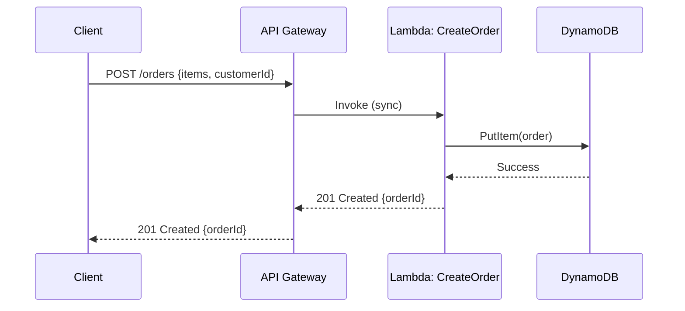
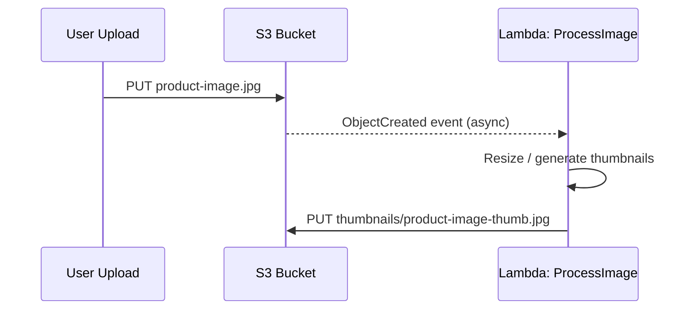
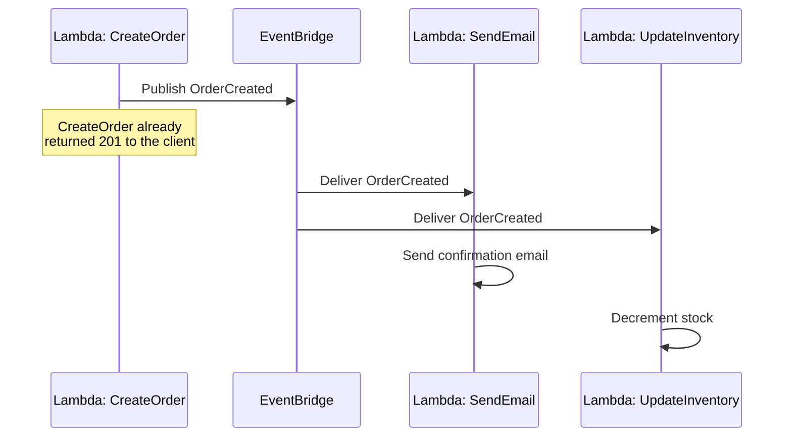
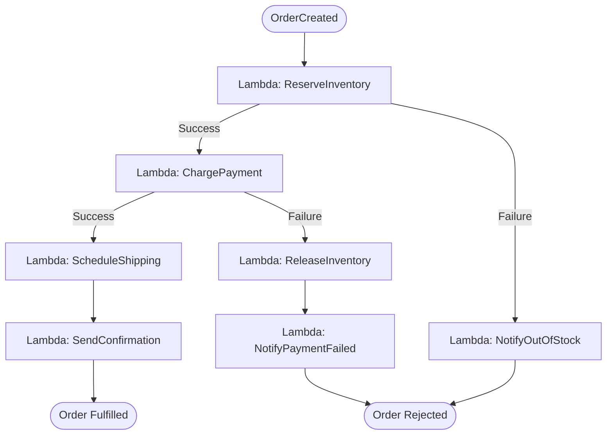
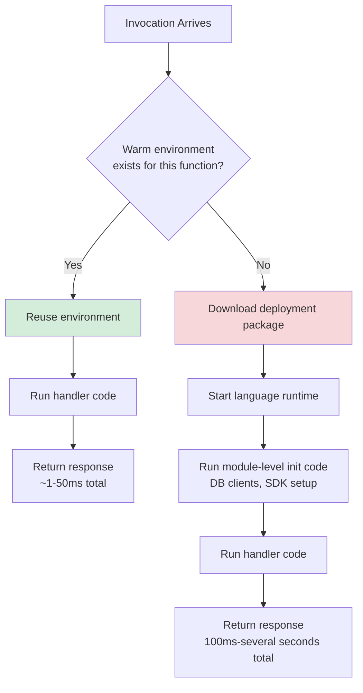

# Serverless: Execution Workflows

## Overview

This document walks through the concrete execution paths a serverless system handles: a synchronous HTTP request, an asynchronous event trigger, an orchestrated multi-step business process, and the difference a cold start makes to each. It builds on the order-processing example introduced in [readme.md](./readme.md) — `CreateOrder`, `DynamoDB`, `EventBridge`, and `SendEmail`.

## Table of Contents

- [Synchronous: HTTP Request via API Gateway](#synchronous-http-request-via-api-gateway)
- [Asynchronous: Event-Triggered Execution](#asynchronous-event-triggered-execution)
- [Orchestrated: Multi-Function Business Process](#orchestrated-multi-function-business-process)
- [Cold Start vs Warm Start Execution Paths](#cold-start-vs-warm-start-execution-paths)

## Synchronous: HTTP Request via API Gateway

The client makes a request and blocks waiting for a response. API Gateway terminates the HTTP connection, invokes the function synchronously, and returns the function's result directly to the client.



Because the client is waiting, this path is latency-sensitive — a cold start here is directly visible to the user. This is the pattern to reach for provisioned concurrency on (see [challenges.md](./challenges.md#cold-starts)) if the endpoint is on a critical user-facing path.

## Asynchronous: Event-Triggered Execution

The producer doesn't wait for the consumer. A function publishes an event or an object lands in storage, and one or more downstream functions are invoked independently, off the request path.

### Object Storage Trigger



### Event Bus Trigger



The key property: `CreateOrder` returns to the caller as soon as it has published the event, without waiting for `SendEmail` or `UpdateInventory` to finish. If either of those fails, the platform retries the invocation automatically (and eventually routes to a dead-letter queue if configured) — the caller is never blocked on, or aware of, that retry.

## Orchestrated: Multi-Function Business Process

A single event fan-out (as above) works for independent side effects, but a business process with sequencing, branching, and compensation logic — an order-fulfillment saga — needs an explicit orchestrator rather than implicit choreography through an event bus. Step Functions (AWS) / Durable Functions (Azure) / Workflows (GCP) fill this role.



```json
{
  "Comment": "Order fulfillment saga",
  "StartAt": "ReserveInventory",
  "States": {
    "ReserveInventory": {
      "Type": "Task",
      "Resource": "arn:aws:lambda:us-east-1:123456789012:function:ReserveInventory",
      "Catch": [{ "ErrorEquals": ["States.ALL"], "Next": "NotifyOutOfStock" }],
      "Next": "ChargePayment"
    },
    "ChargePayment": {
      "Type": "Task",
      "Resource": "arn:aws:lambda:us-east-1:123456789012:function:ChargePayment",
      "Catch": [{ "ErrorEquals": ["States.ALL"], "Next": "ReleaseInventory" }],
      "Next": "ScheduleShipping"
    },
    "ScheduleShipping": {
      "Type": "Task",
      "Resource": "arn:aws:lambda:us-east-1:123456789012:function:ScheduleShipping",
      "Next": "SendConfirmation"
    },
    "SendConfirmation": { "Type": "Task", "Resource": "arn:aws:lambda:us-east-1:123456789012:function:SendConfirmation", "End": true },
    "ReleaseInventory": { "Type": "Task", "Resource": "arn:aws:lambda:us-east-1:123456789012:function:ReleaseInventory", "Next": "NotifyPaymentFailed" },
    "NotifyPaymentFailed": { "Type": "Task", "Resource": "arn:aws:lambda:us-east-1:123456789012:function:NotifyPaymentFailed", "End": true },
    "NotifyOutOfStock": { "Type": "Task", "Resource": "arn:aws:lambda:us-east-1:123456789012:function:NotifyOutOfStock", "End": true }
  }
}
```

The orchestrator tracks state, retries, and compensation transitions explicitly — the individual functions stay simple and stateless, and the saga's control flow lives in one auditable definition instead of being implicitly scattered across event handlers.

## Cold Start vs Warm Start Execution Paths



Two practical takeaways from this diagram:

1. **Module-level initialization only runs on a cold start.** Code placed outside the handler function (creating a database client, loading configuration) executes once per cold environment and is reused by every subsequent warm invocation on that instance — so expensive setup should live there, not inside the handler.
2. **Concurrency, not request rate, determines how many cold starts you see.** A steady trickle of requests mostly hits warm instances; a sudden burst that exceeds currently-running instances forces the platform to cold-start new ones to keep up, regardless of how low the average request rate is.
