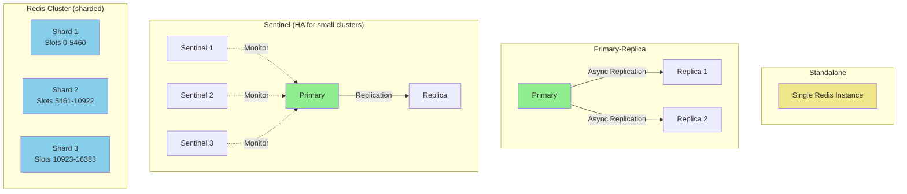
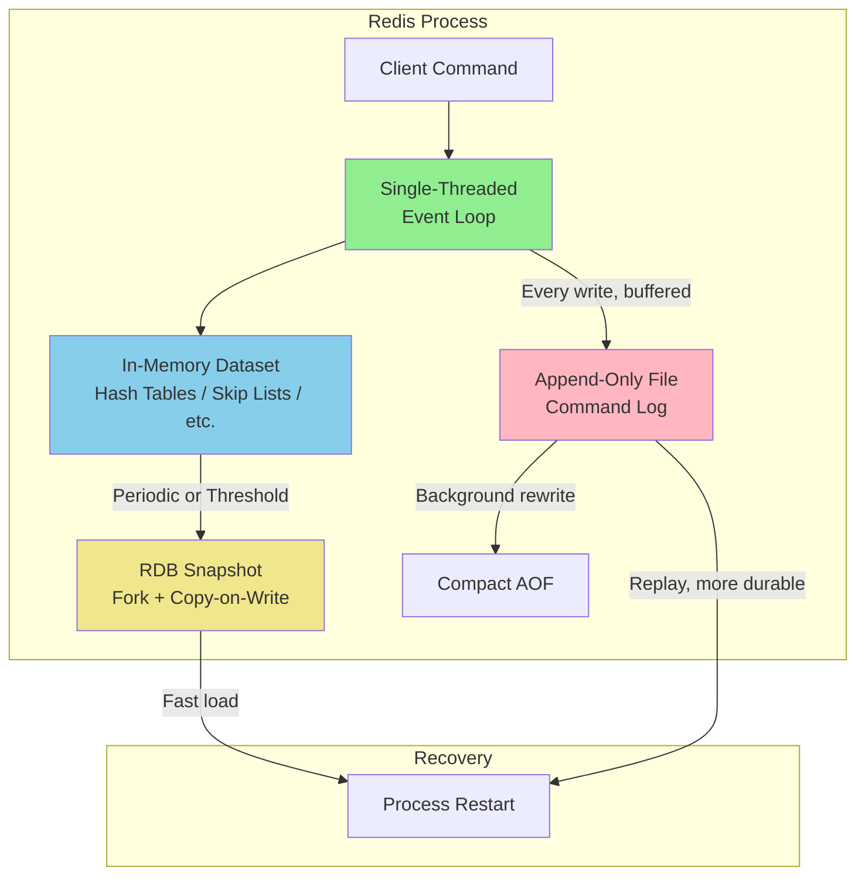
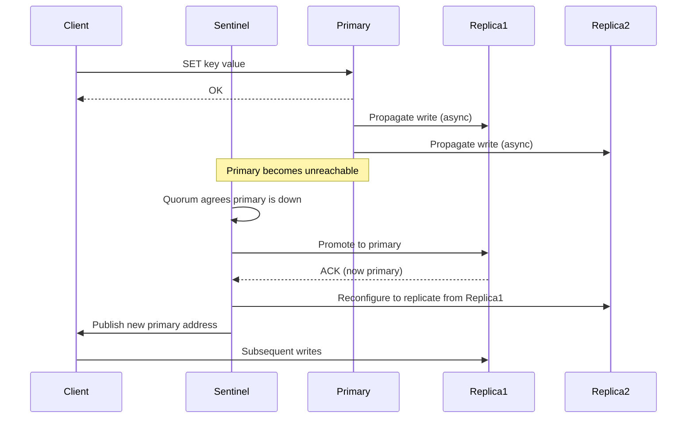
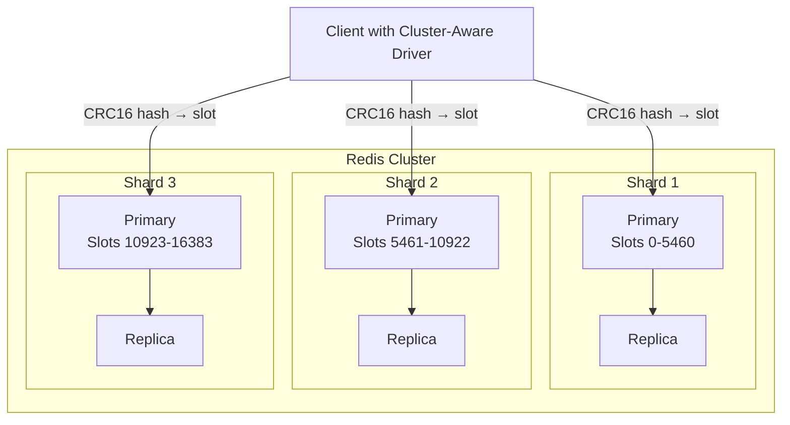

# Redis Case Study

> **Part of**: [Database Case Studies](../README.md) | **Related**: [Scaling Strategies](../../04-scaling_strategies.md), [NoSQL Databases](../../02-nosql.md), [Consistency Models](../../03-consistency.md)

## Table of Contents
- [Overview](#overview)
- [Architecture Deep Dive](#architecture-deep-dive)
- [Data Modeling](#data-modeling)
- [Scaling Strategies](#scaling-strategies)
- [Performance Optimization](#performance-optimization)
- [Operational Considerations](#operational-considerations)
- [Real-World Examples](#real-world-examples)
- [When to Choose Redis](#when-to-choose-redis)

## Overview

Redis (REmote DIctionary Server) is an in-memory data structure store used as a database, cache, message broker, and streaming engine. It keeps its working set in RAM, which gives it sub-millisecond latency, while offering configurable persistence so data can survive restarts.

### Key Characteristics
- **In-Memory Storage**: Primary dataset lives in RAM for sub-millisecond latency
- **Rich Data Structures**: Strings, hashes, lists, sets, sorted sets, streams, bitmaps, HyperLogLog
- **Single-Threaded Core**: Command execution is single-threaded, avoiding lock contention
- **Optional Persistence**: RDB snapshots and/or AOF (Append-Only File) logging
- **Built-In Pub/Sub and Streams**: Native messaging primitives alongside the key-value store

### Core Strengths
- Extremely low latency reads and writes
- Rich data structures beyond simple key-value (sorted sets, hashes, streams)
- Atomic operations, including multi-key transactions (MULTI/EXEC) and Lua scripting
- Native TTL support for cache expiration
- Simple operational model at small-to-medium scale

### Limitations
- Dataset must fit in memory (or be partitioned across a cluster)
- Single-threaded command execution limits CPU-bound throughput per node
- Persistence trades off durability against performance (AOF fsync cost, RDB fork cost)
- Cluster mode adds operational and client-side complexity
- Not designed for complex ad-hoc queries or joins

## Architecture Deep Dive

### Redis Deployment Topologies



### In-Memory Storage and Persistence Architecture



### Replication and Failover



## Data Modeling

Redis is schemaless; correct modeling means picking the right data structure and key layout for each access pattern.

### Data Structure Selection

| Structure | Use Case | Example Commands |
|-----------|----------|-------------------|
| **String** | Simple cache values, counters, flags | `SET`, `GET`, `INCR` |
| **Hash** | Objects with multiple fields (user profile) | `HSET`, `HGET`, `HGETALL` |
| **List** | Queues, recent-items lists | `LPUSH`, `RPOP`, `LRANGE` |
| **Set** | Unique membership, tag sets | `SADD`, `SISMEMBER`, `SINTER` |
| **Sorted Set** | Leaderboards, rate limiting windows, priority queues | `ZADD`, `ZRANGE`, `ZINCRBY` |
| **Stream** | Event logs, message queues with consumer groups | `XADD`, `XREAD`, `XACK` |
| **Bitmap / HyperLogLog** | Compact flags, approximate cardinality | `SETBIT`, `PFADD`, `PFCOUNT` |

### Key Naming Patterns

```
# Namespaced, colon-delimited keys keep the keyspace organized
user:{user_id}:profile
user:{user_id}:sessions
product:{product_id}:inventory
order:{order_id}:status

# Time-bucketed keys for rate limiting / analytics
ratelimit:{user_id}:{minute_bucket}
metrics:api_calls:{date}:{hour}
```

### Data Modeling Examples

#### Session Store

```
# Store session as a hash with a TTL
HSET session:{session_id} user_id 12345 issued_at 1717000000 ip 203.0.113.7
EXPIRE session:{session_id} 1800   # 30-minute sliding expiry

# Refresh on each request
EXPIRE session:{session_id} 1800
```

#### Leaderboard with Sorted Sets

```
# Update a player's score
ZADD leaderboard:global 15420 player:9081

# Top 10 players
ZREVRANGE leaderboard:global 0 9 WITHSCORES

# A player's rank
ZREVRANK leaderboard:global player:9081
```

#### Sliding-Window Rate Limiter

```
# One sorted set per client; score = request timestamp
ZADD ratelimit:{client_id} {now} {now}-{random}
ZREMRANGEBYSCORE ratelimit:{client_id} -inf {now_minus_window}
ZCARD ratelimit:{client_id}   # current count in window
EXPIRE ratelimit:{client_id} {window_seconds}
```

#### Cache-Aside Pattern

```python
def get_product(product_id):
    key = f"product:{product_id}"
    cached = redis.get(key)
    if cached:
        return json.loads(cached)

    product = db.query_product(product_id)
    redis.set(key, json.dumps(product), ex=300)  # 5-minute TTL
    return product
```

#### Streams as a Durable Queue

```
# Producer
XADD orders:events * order_id 5001 status "created"

# Consumer group
XGROUP CREATE orders:events order-processors $ MKSTREAM
XREADGROUP GROUP order-processors worker-1 COUNT 10 STREAMS orders:events >
XACK orders:events order-processors 1717000000-0
```

## Scaling Strategies

### Vertical Scaling and Read Replicas

The simplest scaling path is a larger primary plus read replicas for read-heavy workloads:

```bash
# redis.conf on a replica
replicaof primary-host 6379
replica-read-only yes

# Route reads to replicas at the application/client layer,
# writes always go to the primary
```

### Redis Cluster (Horizontal Sharding)

Redis Cluster partitions the keyspace into 16,384 hash slots distributed across shards.

```bash
# Create a 3-shard, 1-replica-per-shard cluster from 6 nodes
redis-cli --cluster create \
  10.0.0.1:6379 10.0.0.2:6379 10.0.0.3:6379 \
  10.0.0.4:6379 10.0.0.5:6379 10.0.0.6:6379 \
  --cluster-replicas 1

# Check slot distribution
redis-cli --cluster check 10.0.0.1:6379

# Resharding when adding a node
redis-cli --cluster reshard 10.0.0.1:6379
```



Key design implication: multi-key operations (transactions, Lua scripts) only work atomically when all keys hash to the same slot. Use **hash tags** (`{user123}:profile`, `{user123}:sessions`) to force related keys onto one slot.

### High Availability with Sentinel

For deployments that don't need sharding but do need automatic failover, Sentinel monitors a primary/replica set and promotes a replica if the primary fails, without requiring cluster-mode clients.

## Performance Optimization

### Memory Optimization

```bash
# Use compact encodings for small collections
hash-max-listpack-entries 128
hash-max-listpack-value 64
set-max-listpack-entries 128
zset-max-listpack-entries 128

# Evict data once maxmemory is reached
maxmemory 4gb
maxmemory-policy allkeys-lru   # or volatile-lru, volatile-ttl, allkeys-lfu
```

### Pipelining and Batching

```python
# Without pipelining: N round trips
for key in keys:
    redis.get(key)

# With pipelining: 1 round trip
pipe = redis.pipeline()
for key in keys:
    pipe.get(key)
results = pipe.execute()
```

### Persistence Tuning

```bash
# RDB: periodic snapshots, fast restarts, some data loss window
save 900 1
save 300 10
save 60 10000

# AOF: every-write durability, larger files, slower restarts
appendonly yes
appendfsync everysec      # balance of durability and throughput
auto-aof-rewrite-percentage 100
auto-aof-rewrite-min-size 64mb
```

### Monitoring Key Metrics

```bash
# Real-time command and latency stats
redis-cli INFO stats
redis-cli --latency
redis-cli --latency-history

# Slow query log
redis-cli SLOWLOG GET 10
redis-cli CONFIG SET slowlog-log-slower-than 10000  # microseconds

# Memory usage per key pattern
redis-cli --bigkeys
MEMORY USAGE {key}
```

Key metrics to watch: `instantaneous_ops_per_sec`, `used_memory` vs `maxmemory`, `evicted_keys`, `keyspace_hits` / `keyspace_misses` (cache hit ratio), `connected_clients`, and replication lag (`master_repl_offset` vs replica offset).

## Operational Considerations

### Backup and Recovery

```bash
# Trigger a background RDB save
redis-cli BGSAVE

# Copy the resulting dump.rdb off-box
cp /var/lib/redis/dump.rdb /backup/redis/dump-$(date +%F).rdb

# Restore: stop Redis, place dump.rdb in the data dir, start Redis
sudo systemctl stop redis
cp /backup/redis/dump-2026-09-01.rdb /var/lib/redis/dump.rdb
sudo systemctl start redis
```

### Cluster Maintenance

```bash
# Rolling upgrade of a replica first, then failover, then upgrade old primary
redis-cli -h replica-host SHUTDOWN NOSAVE
# ... upgrade binary, restart, let it resync ...

redis-cli -h primary-host FAILOVER  # promote replica gracefully
# ... upgrade the now-replica former primary ...
```

### Security Configuration

```bash
# Require authentication
requirepass a-strong-generated-password

# Prefer fine-grained ACLs over a single shared password
ACL SETUSER app-service on >app-password ~product:* ~order:* +get +set +del -flushall

# Rename or disable dangerous commands
rename-command FLUSHALL ""
rename-command CONFIG "CONFIG_9f2a"

# Enable TLS between clients and Redis (Redis 6+)
tls-port 6380
tls-cert-file /etc/redis/redis.crt
tls-key-file /etc/redis/redis.key
```

## Real-World Examples

### Twitter: Timeline and Object Caching

Twitter uses Redis-family stores to cache assembled timelines and hot objects so that read-heavy timeline requests avoid hitting the primary datastore on every request, using sorted sets keyed by user for chronological timeline entries and hashes for cached object data with short TTLs.

### GitHub: Rate Limiting and Job Queues

GitHub uses Redis-backed sorted sets and lists for API rate limiting (sliding-window counters keyed per token) and for background job queues that feed worker pools, relying on Redis's atomic increment and expiry primitives to avoid race conditions under high concurrency.

### Gaming Leaderboards

Real-time multiplayer games commonly use Redis sorted sets for global and per-region leaderboards:

```
ZADD leaderboard:region:eu 98450 player:4471
ZREVRANGE leaderboard:region:eu 0 99 WITHSCORES   # top 100
ZSCORE leaderboard:region:eu player:4471           # a player's score
```

The `O(log N)` complexity of sorted-set operations keeps leaderboard updates and top-N queries fast even with millions of players.

## When to Choose Redis

### Ideal Use Cases

1. **Caching Layers**
   - Database query result caching
   - Session storage
   - HTML fragment / API response caching

2. **Real-Time Data Structures**
   - Leaderboards and counters
   - Rate limiting and throttling
   - Pub/Sub notifications and lightweight event streaming

3. **Low-Latency Lookups**
   - Feature flags and configuration
   - Deduplication (via sets)
   - Approximate counting (HyperLogLog)

### Avoid Redis When

1. **Dataset Far Exceeds Available Memory Budget**
   - Very large, cold datasets better suited to disk-based stores

2. **Strict Durability Is Required Without Extra Engineering**
   - Financial ledgers needing synchronous, multi-node durability guarantees

3. **Complex Relational Queries**
   - Ad-hoc joins, multi-table aggregations, reporting workloads

### Decision Matrix

| Factor | Redis Score (1-5) | Notes |
|--------|--------------------|-------|
| Read/Write Latency | 5 | In-memory, sub-millisecond |
| Data Structure Flexibility | 5 | Rich native structures beyond key-value |
| Durability | 2-3 | Configurable via RDB/AOF, still memory-bound |
| Query Flexibility | 2 | No joins, limited ad-hoc querying |
| Horizontal Scalability | 4 | Redis Cluster scales well with hash-tag discipline |
| Operational Simplicity | 4 (standalone) / 2 (cluster) | Standalone is simple; cluster adds complexity |
| Cost Efficiency | 3 | Memory is more expensive than disk per GB |

## Conclusion

Redis's combination of in-memory speed and rich data structures makes it the default choice for caching, session storage, real-time counters, and leaderboard-style workloads. Its single-threaded core keeps behavior predictable and free of lock contention, while replication, Sentinel, and Redis Cluster provide a path from a single instance to a highly available, horizontally sharded deployment.

The trade-off is that memory is the hard scaling constraint, and durability has to be explicitly engineered via RDB snapshots and/or AOF logging rather than assumed. Applications with large cold datasets or strict multi-node durability requirements should pair Redis with a persistent store rather than use it as the system of record on its own.

---

**Next Steps**:
- Review [MongoDB Case Study](02-mongodb.md) for document-oriented alternatives
- Explore [DynamoDB Case Study](04-dynamodb.md) for a fully managed key-value/document option
- Explore [Scaling Strategies](../../04-scaling_strategies.md) for additional scaling patterns
- Consider [Cassandra Case Study](03-cassandra.md) for write-heavy, horizontally scaled workloads
