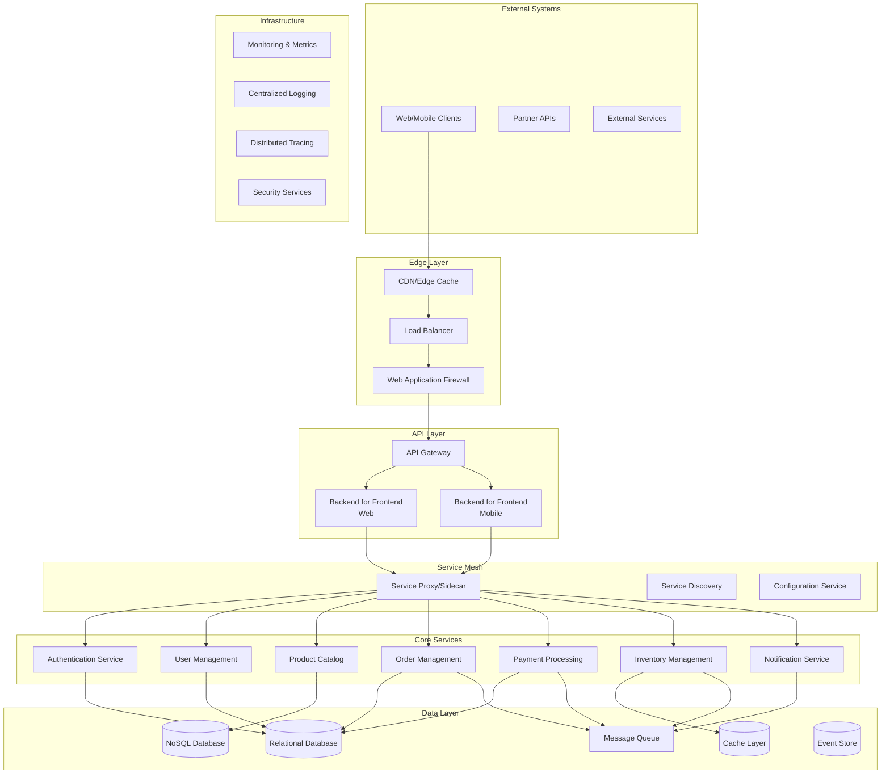

# Backend Microservices: Complete Guide

A comprehensive, production-ready guide to designing, building, and operating backend microservices — from service boundaries to distributed resilience patterns.

## 📚 Documentation Structure

This guide is organized into focused sections for better navigation and maintenance:

### Core Concepts
- **[Introduction](docs/01-introduction.md)** - Monolith vs microservices, when to use them, and trade-offs
- **[Service Architecture](docs/02-service-architecture.md)** - Decomposition strategies, service boundaries, and API design

### Data & Communication
- **[Database Patterns](docs/03-database-patterns.md)** - Database per service, event sourcing, CQRS, and sagas
- **[Communication](docs/04-communication.md)** - REST, gRPC, message queues, and event-driven communication

### Deployment & Operations
- **[Deployment Strategies](docs/05-deployment-strategies.md)** - Docker, Kubernetes, CI/CD, and blue-green deployments
- **[Security](docs/06-security.md)** - Authentication, authorization, mTLS, and API security
- **[Observability](docs/07-observability.md)** - Distributed tracing, metrics, and log aggregation

### Reliability & Quality
- **[Resilience](docs/08-resilience.md)** - Circuit breakers, retries, bulkheads, and timeouts
- **[Performance Optimization](docs/09-performance-optimization.md)** - Caching, load balancing, and database tuning
- **[Testing](docs/10-testing.md)** - Unit, integration, contract, and end-to-end testing

### Advanced Topics
- **[Tools Ecosystem](docs/11-tools-ecosystem.md)** - Service mesh, API gateways, and observability tooling
- **[Best Practices](docs/12-best-practises.md)** - Design principles, common pitfalls, and checklists

## 🚀 Quick Start

```bash
# Start local infrastructure
docker-compose up -d

# Start services in development
npm run dev

# Run integration tests
npm run test:integration
```

## 📖 Learning Path

### Beginner (Weeks 1-2)
1. Read [Introduction](docs/01-introduction.md)
2. Study [Service Architecture](docs/02-service-architecture.md)
3. Learn [Database Patterns](docs/03-database-patterns.md)

### Intermediate (Weeks 3-4)
1. Explore [Communication](docs/04-communication.md)
2. Implement [Resilience](docs/08-resilience.md) patterns
3. Set up [Testing](docs/10-testing.md)

### Advanced (Weeks 5-6)
1. Configure [Deployment Strategies](docs/05-deployment-strategies.md)
2. Implement [Security](docs/06-security.md)
3. Set up [Observability](docs/07-observability.md)

### Expert (Week 7+)
1. Optimize with [Performance Optimization](docs/09-performance-optimization.md)
2. Explore the [Tools Ecosystem](docs/11-tools-ecosystem.md)
3. Apply [Best Practices](docs/12-best-practises.md) across your services

## 🛠️ Architecture Overview



## 🎯 Key Characteristics

- **Independent Deployability**: Services can be deployed independently
- **Business Domain Focus**: Services align with business capabilities
- **Decentralized Governance**: Teams own their services end-to-end
- **Technology Diversity**: Freedom to choose appropriate tech stack per service
- **Failure Isolation**: Failures are contained within service boundaries

## 🔧 Technology Standards

| Category | Primary Choice | Alternatives |
|----------|----------------|---------------|
| **Service Runtime** | Node.js/NestJS, Go, Java/Spring Boot | Python/FastAPI, C#/ASP.NET Core, Rust |
| **Message Broker** | Apache Kafka | RabbitMQ, Redis Pub/Sub, AWS SQS/SNS |
| **Relational Store** | PostgreSQL | MySQL |
| **Document Store** | MongoDB | DynamoDB |
| **Service Mesh** | Istio, Linkerd | Consul Connect |
| **Orchestration** | Kubernetes | Docker Swarm, Nomad |

Full comparisons with pros/cons live in [Tools Ecosystem](docs/11-tools-ecosystem.md).

## 🤝 Contributing

We welcome contributions! Please:

1. Fork the repository
2. Create a feature branch
3. Make your changes
4. Add/update documentation
5. Submit a pull request

---

Remember: microservices are a means to an end, not the end goal. Focus on delivering business value while maintaining system reliability, scalability, and maintainability.
