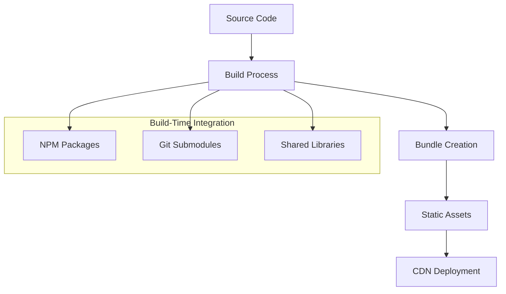
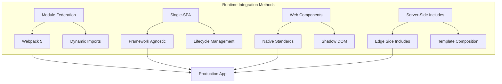

## Runtime Integration Patterns {#runtime-integration}

### 1. Build-Time Integration



### 2. Runtime Integration



### Module Federation Implementation

```typescript
// Shell application component
import React, { Suspense } from 'react';

const HeaderService = React.lazy(() => import('headerService/Header'));
const ProductCatalog = React.lazy(() => import('productCatalog/ProductList'));

function App() {
  return (
    <div className="app">
      <Suspense fallback={<div>Loading header...</div>}>
        <HeaderService />
      </Suspense>
      
      <main>
        <Suspense fallback={<div>Loading products...</div>}>
          <ProductCatalog />
        </Suspense>
      </main>
    </div>
  );
}

export default App;
```

### State Management Across Microservices

```mermaid
graph TB
    subgraph "State Management Strategies"
        A[Local State] --> A1[Component State]
        A --> A2[Service State]
        
        B[Shared State] --> B1[Event Bus]
        B --> B2[State Store]
        B --> B3[URL State]
        
        C[External State] --> C1[APIs]
        C --> C2[Databases]
        C --> C3[Browser Storage]
    end
    
    subgraph "Implementation"
        D[Microservice 1] --> E[Shared Store]
        F[Microservice 2] --> E
        G[Microservice 3] --> E
        E --> H[State Synchronization]# Security Architecture for Frontend Microservices

Implementing robust security across distributed frontend architectures requires careful planning and consistent implementation patterns.

## 🔐 Authentication Architecture

### Single Sign-On (SSO) Implementation

```javascript
// auth-service/src/authProvider.js
class AuthProvider {
  constructor() {
    this.token = null;
    this.refreshToken = null;
    this.user = null;
  }

  async login(credentials) {
    const response = await fetch('/api/auth/login', {
      method: 'POST',
      headers: { 'Content-Type': 'application/json' },
      body: JSON.stringify(credentials)
    });
    
    const { token, refreshToken, user } = await response.json();
    
    this.setTokens(token, refreshToken);
    this.user = user;
    this.broadcastAuthState();
    
    return user;
  }

  setTokens(token, refreshToken) {
    this.token = token;
    this.refreshToken = refreshToken;
    
    // Secure storage
    sessionStorage.setItem('auth_token', token);
    localStorage.setItem('refresh_token', refreshToken);
  }

  broadcastAuthState() {
    window.dispatchEvent(new CustomEvent('auth:change', {
      detail: { user: this.user, token: this.token }
    }));
  }

  async refreshTokens() {
    if (!this.refreshToken) throw new Error('No refresh token');
    
    const response = await fetch('/api/auth/refresh', {
      method: 'POST',
      headers: { 
        'Authorization': `Bearer ${this.refreshToken}`,
        'Content-Type': 'application/json'
      }
    });
    
    const { token, refreshToken } = await response.json();
    this.setTokens(token, refreshToken);
  }
}

export const authProvider = new AuthProvider();
```

### JWT Token Management

```javascript
// shared/src/tokenManager.js
class TokenManager {
  constructor() {
    this.setupInterceptors();
  }

  setupInterceptors() {
    // Axios request interceptor
    axios.interceptors.request.use(
      (config) => {
        const token = authProvider.token;
        if (token) {
          config.headers.Authorization = `Bearer ${token}`;
        }
        return config;
      },
      (error) => Promise.reject(error)
    );

    // Response interceptor for token refresh
    axios.interceptors.response.use(
      (response) => response,
      async (error) => {
        if (error.response?.status === 401) {
          try {
            await authProvider.refreshTokens();
            return axios.request(error.config);
          } catch (refreshError) {
            authProvider.logout();
            window.location.href = '/login';
          }
        }
        return Promise.reject(error);
      }
    );
  }
}
```

## 🛡️ Authorization Patterns

### Role-Based Access Control (RBAC)

```javascript
// shared/src/permissions.js
class PermissionManager {
  constructor() {
    this.permissions = new Map();
    this.roles = new Map();
  }

  defineRole(roleName, permissions) {
    this.roles.set(roleName, new Set(permissions));
  }

  hasPermission(userRoles, requiredPermission) {
    return userRoles.some(role => 
      this.roles.get(role)?.has(requiredPermission)
    );
  }

  canAccess(userRoles, resource, action) {
    const permission = `${resource}:${action}`;
    return this.hasPermission(userRoles, permission);
  }
}

// Permission definitions
const permissionManager = new PermissionManager();

permissionManager.defineRole('admin', [
  'users:read', 'users:write', 'users:delete',
  'products:read', 'products:write', 'products:delete'
]);

permissionManager.defineRole('user', [
  'profile:read', 'profile:write',
  'products:read', 'orders:read'
]);

export { permissionManager };
```

### Route Protection

```javascript
// shell/src/components/ProtectedRoute.js
import { permissionManager } from '@shared/permissions';

function ProtectedRoute({ children, requiredPermissions, fallback }) {
  const { user } = useAuth();

  const hasAccess = requiredPermissions.every(permission =>
    permissionManager.hasPermission(user?.roles || [], permission)
  );

  if (!user) {
    return <Navigate to="/login" />;
  }

  if (!hasAccess) {
    return fallback || <div>Access Denied</div>;
  }

  return children;
}

// Usage in routing
<Route path="/admin" element={
  <ProtectedRoute requiredPermissions={['users:read']}>
    <AdminModule />
  </ProtectedRoute>
} />
```

## 🔒 Content Security Policy (CSP)

### CSP Configuration

```javascript
// shell/webpack.config.js
const HtmlWebpackPlugin = require('html-webpack-plugin');

module.exports = {
  plugins: [
    new HtmlWebpackPlugin({
      template: './src/index.html',
      cspPlugin: {
        enabled: true,
        policy: {
          'default-src': ["'self'"],
          'script-src': [
            "'self'",
            "'unsafe-eval'", // Required for Module Federation
            "https://trusted-cdn.example.com"
          ],
          'style-src': [
            "'self'",
            "'unsafe-inline'", // Required for CSS-in-JS
            "https://fonts.googleapis.com"
          ],
          'img-src': [
            "'self'",
            "data:",
            "https://images.example.com"
          ],
          'connect-src': [
            "'self'",
            "https://api.example.com",
            "wss://websocket.example.com"
          ]
        }
      }
    })
  ]
};
```

## 🌐 Cross-Origin Communication Security

### Secure Message Passing

```javascript
// shared/src/secureMessaging.js
class SecureMessaging {
  constructor(allowedOrigins = []) {
    this.allowedOrigins = new Set(allowedOrigins);
    this.setupMessageHandler();
  }

  setupMessageHandler() {
    window.addEventListener('message', (event) => {
      if (!this.isOriginAllowed(event.origin)) {
        console.warn(`Blocked message from unauthorized origin: ${event.origin}`);
        return;
      }

      this.handleMessage(event.data, event.origin);
    });
  }

  isOriginAllowed(origin) {
    return this.allowedOrigins.has(origin) || 
           this.allowedOrigins.has('*');
  }

  sendSecureMessage(targetWindow, data, targetOrigin) {
    if (!this.isOriginAllowed(targetOrigin)) {
      throw new Error(`Cannot send message to unauthorized origin: ${targetOrigin}`);
    }

    const secureData = {
      timestamp: Date.now(),
      nonce: crypto.randomUUID(),
      payload: data
    };

    targetWindow.postMessage(secureData, targetOrigin);
  }

  handleMessage(data, origin) {
    // Validate message structure
    if (!data.timestamp || !data.nonce || !data.payload) {
      console.warn('Invalid message format');
      return;
    }

    // Check message age (prevent replay attacks)
    const messageAge = Date.now() - data.timestamp;
    if (messageAge > 30000) { // 30 seconds
      console.warn('Message too old, rejecting');
      return;
    }

    this.processMessage(data.payload);
  }
}
```

## 🔐 API Security

### Request Signing

```javascript
// shared/src/apiSecurity.js
class APISecurityManager {
  constructor(secretKey) {
    this.secretKey = secretKey;
  }

  async signRequest(method, url, body = '') {
    const timestamp = Date.now();
    const nonce = crypto.randomUUID();
    
    const message = `${method}|${url}|${body}|${timestamp}|${nonce}`;
    
    const encoder = new TextEncoder();
    const key = await crypto.subtle.importKey(
      'raw',
      encoder.encode(this.secretKey),
      { name: 'HMAC', hash: 'SHA-256' },
      false,
      ['sign']
    );

    const signature = await crypto.subtle.sign(
      'HMAC',
      key,
      encoder.encode(message)
    );

    return {
      timestamp,
      nonce,
      signature: Array.from(new Uint8Array(signature))
        .map(b => b.toString(16).padStart(2, '0'))
        .join('')
    };
  }

  async makeSecureRequest(url, options = {}) {
    const { method = 'GET', body } = options;
    const bodyString = body ? JSON.stringify(body) : '';
    
    const { timestamp, nonce, signature } = await this.signRequest(
      method, 
      url, 
      bodyString
    );

    return fetch(url, {
      ...options,
      headers: {
        ...options.headers,
        'X-Timestamp': timestamp,
        'X-Nonce': nonce,
        'X-Signature': signature,
        'Content-Type': 'application/json'
      },
      body: bodyString || undefined
    });
  }
}
```

## 🛡️ Input Sanitization

### XSS Prevention

```javascript
// shared/src/sanitizer.js
import DOMPurify from 'dompurify';

class InputSanitizer {
  static sanitizeHTML(html) {
    return DOMPurify.sanitize(html, {
      ALLOWED_TAGS: ['b', 'i', 'em', 'strong', 'a', 'p', 'br'],
      ALLOWED_ATTR: ['href', 'title'],
      ALLOW_DATA_ATTR: false
    });
  }

  static sanitizeUserInput(input) {
    if (typeof input !== 'string') return input;
    
    return input
      .replace(/[<>'"]/g, (char) => ({
        '<': '&lt;',
        '>': '&gt;',
        '"': '&quot;',
        "'": '&#x27;'
      }[char]));
  }

  static validateEmail(email) {
    const emailRegex = /^[^\s@]+@[^\s@]+\.[^\s@]+$/;
    return emailRegex.test(email) && email.length <= 254;
  }

  static validateURL(url) {
    try {
      const parsedURL = new URL(url);
      return ['http:', 'https:'].includes(parsedURL.protocol);
    } catch {
      return false;
    }
  }
}

// React Hook for sanitized input
function useSanitizedInput(initialValue = '') {
  const [value, setValue] = useState(initialValue);
  
  const setSanitizedValue = useCallback((newValue) => {
    setValue(InputSanitizer.sanitizeUserInput(newValue));
  }, []);

  return [value, setSanitizedValue];
}
```

## 🔍 Security Headers

### Middleware Configuration

```javascript
// server/middleware/security.js
function securityHeaders() {
  return (req, res, next) => {
    // Prevent clickjacking
    res.setHeader('X-Frame-Options', 'SAMEORIGIN');
    
    // XSS protection
    res.setHeader('X-XSS-Protection', '1; mode=block');
    
    // Content type sniffing prevention
    res.setHeader('X-Content-Type-Options', 'nosniff');
    
    // Referrer policy
    res.setHeader('Referrer-Policy', 'strict-origin-when-cross-origin');
    
    // HTTPS enforcement
    res.setHeader('Strict-Transport-Security', 
      'max-age=31536000; includeSubDomains; preload');
    
    // Permission policy
    res.setHeader('Permissions-Policy', 
      'camera=(), microphone=(), geolocation=()');

    next();
  };
}
```

## 🚨 Security Monitoring

### Security Event Logger

```javascript
// shared/src/securityLogger.js
class SecurityLogger {
  constructor(endpoint) {
    this.endpoint = endpoint;
    this.queue = [];
    this.flushInterval = 5000;
    
    this.startPeriodicFlush();
  }

  logSecurityEvent(event) {
    const securityEvent = {
      type: event.type,
      severity: event.severity,
      timestamp: new Date().toISOString(),
      userAgent: navigator.userAgent,
      url: window.location.href,
      userId: authProvider.user?.id,
      details: event.details
    };

    this.queue.push(securityEvent);
    
    if (event.severity === 'critical') {
      this.flush();
    }
  }

  async flush() {
    if (this.queue.length === 0) return;

    const events = [...this.queue];
    this.queue = [];

    try {
      await fetch(this.endpoint, {
        method: 'POST',
        headers: { 'Content-Type': 'application/json' },
        body: JSON.stringify({ events })
      });
    } catch (error) {
      // Re-queue events on failure
      this.queue.unshift(...events);
    }
  }

  startPeriodicFlush() {
    setInterval(() => this.flush(), this.flushInterval);
  }
}

const securityLogger = new SecurityLogger('/api/security/events');

// Usage examples
securityLogger.logSecurityEvent({
  type: 'authentication_failure',
  severity: 'medium',
  details: { attempts: 3, reason: 'invalid_password' }
});

securityLogger.logSecurityEvent({
  type: 'unauthorized_access',
  severity: 'high',
  details: { resource: '/admin', requiredRole: 'admin' }
});
```

## 🔧 Environment-Specific Security

### Development vs Production

```javascript
// shared/src/securityConfig.js
const SecurityConfig = {
  development: {
    allowUnsafeInline: true,
    corsOrigins: ['http://localhost:3000', 'http://localhost:3001'],
    logLevel: 'debug',
    enableSourceMaps: true
  },
  
  production: {
    allowUnsafeInline: false,
    corsOrigins: ['https://app.example.com'],
    logLevel: 'error',
    enableSourceMaps: false,
    requireHTTPS: true,
    enableHSTS: true
  }
};

export const getSecurityConfig = () => {
  return SecurityConfig[process.env.NODE_ENV] || SecurityConfig.production;
};
```

## 📋 Security Checklist

### Pre-Deployment Security Review

- [ ] Authentication implemented with secure token storage
- [ ] Authorization rules defined and enforced
- [ ] CSP headers configured for all services
- [ ] Input sanitization applied to all user inputs
- [ ] HTTPS enforced in production
- [ ] Security headers implemented
- [ ] Cross-origin policies configured
- [ ] API requests signed and validated
- [ ] Security monitoring and logging active
- [ ] Dependency vulnerabilities scanned
- [ ] Environment-specific configurations applied
- [ ] Error messages don't leak sensitive information

### Regular Security Maintenance

1. **Weekly**: Review security logs and alerts
2. **Monthly**: Update dependencies and scan for vulnerabilities
3. **Quarterly**: Security architecture review
4. **Annually**: Penetration testing and security audit

This security architecture provides a robust foundation for protecting frontend microservices while maintaining the flexibility and independence that makes the architecture valuable.
        H --> I[UI Updates]
    end
```


---

For more information, see:
- [Cross framework](05-cross-framework.md)
- [Deployment strategies](06-deployment-strategies.md)
- [Performance & Monitoring](07-performance-monitoring.md)